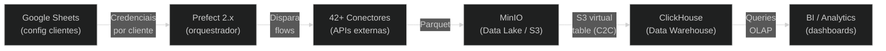

# Documentacao Tecnica - Nalk Data Pipeline

> **Indice central de toda a documentacao do sistema.**
>
> Este repositorio e o **pipeline canonico** de dados da plataforma Nalk.
> Utiliza **Prefect 2.x** como orquestrador, **MinIO** como data lake e **ClickHouse** como data warehouse.
> Suporta **42+ integracoes** com processamento multi-cliente.

---

## Documentos Disponiveis

| Documento | Publico-Alvo | Descricao |
|-----------|-------------|-----------|
| [architecture-overview.md](./architecture-overview.md) | Todos | Visao geral da arquitetura, stack tecnologica e componentes |
| [pipeline-flow.md](./pipeline-flow.md) | Todos | Diagramas sequenciais e de fluxo de cada etapa do pipeline |
| [module-reference.md](./module-reference.md) | Devs | Referencia tecnica de todos os modulos, classes e funcoes |
| [howto-add-client.md](./howto-add-client.md) | CS / Operacoes | Passo a passo para cadastrar um novo cliente (sem codigo) |
| [howto-add-crm-integration.md](./howto-add-crm-integration.md) | Devs | Como criar uma nova integracao do zero |
| [junior-guide.md](./junior-guide.md) | Junior e Senior | Guia geral com glossario, metaforas e decisoes arquiteturais |

### Documentos de Analise

| Documento | Descricao |
|-----------|-----------|
| [analise-arquitetural.md](./analise-arquitetural.md) | Analise de redundancia, SOLID, DDD e arquitetura hexagonal |
| [analise-arquitetural-legado.md](./analise-arquitetural-legado.md) | Analise dos repositorios legado (airflow + airflow-tasks) |

---

## Quick Start

### Quero entender o sistema pela primeira vez
Leia: [architecture-overview.md](./architecture-overview.md)

### Quero adicionar um novo cliente
Leia: [howto-add-client.md](./howto-add-client.md)

### Quero criar uma nova integracao
Leia: [howto-add-crm-integration.md](./howto-add-crm-integration.md)

### Sou desenvolvedor junior, por onde comeco?
Leia: [junior-guide.md](./junior-guide.md)

### Quero entender as decisoes arquiteturais
Leia: [junior-guide.md](./junior-guide.md) (secao "Para Desenvolvedores Seniores")

---

## Mapa Rapido do Sistema



---

## Infraestrutura

O pipeline roda via Docker Compose com os seguintes servicos:

| Servico | Porta | Descricao |
|---------|-------|-----------|
| `prefect-server` | 4200 | API e UI do Prefect |
| `prefect-worker` | - | Executor dos flows |
| `minio` | 9000 / 9001 | Object storage (API / Console) |
| ClickHouse | 8123 | Data warehouse (externo ao compose) |

### Iniciar o ambiente

```bash
# Subir todos os servicos
docker-compose up -d

# Verificar saude
python flows/health_check_flow.py
```

### Acessos

| Interface | URL | Credenciais |
|-----------|-----|------------|
| Prefect UI | http://localhost:4200 | - |
| MinIO Console | http://localhost:9001 | admin / miniopassword123 |
| ClickHouse | http://localhost:8123 | Configurado em .env |

---

## Integracoes Suportadas (42)

| Categoria | Qtd | Plataformas |
|-----------|-----|-------------|
| Ads e Marketing | 6 | Meta Ads, Google Ads, RD Marketing, Brevo, Mautic, Active Campaign |
| CRM | 8 | HubSpot, Pipedrive, Ploomes, Piperun, Moskit, RD CRM, C2S, Leads2b |
| CRM Imobiliario | 8 | CVCRM CVDW, CVCRM CVIO, Arbo, Hypnobox, Imobzi, Facilita, Sigavi, Groner |
| E-commerce | 3 | Shopify, Hotmart, Eduzz |
| Financeiro | 5 | Asaas, Superlogica, Vindi, Acert, Clicksign |
| ERP | 2 | OMIE, Everflow |
| Outros | 10 | ClickUp, Digisac, Native, Evo, Belle, Learn Words, PayTour, Silbeck, Leads2b |

---

## CI/CD

| Pipeline | Trigger | Etapas |
|----------|---------|--------|
| CI (`.github/workflows/ci.yml`) | Push / PR | Ruff lint, py_compile, check secrets, validate YAML |
| Deploy (`.github/workflows/deploy.yml`) | Push to main | CI + Docker build (GHCR) + Prefect deploy --all |

---

## Repositorios

| Repositorio | Status | Descricao |
|-------------|--------|-----------|
| `teste-pipeline` (este) | **Ativo** | Pipeline canonico Prefect 2.x |
| `airflow` (legado) | Deprecated | Orquestrador Airflow antigo |
| `airflow-tasks` (legado) | Deprecated | Extratores Docker individuais |

---

*Documentacao atualizada em Marco 2026.*
