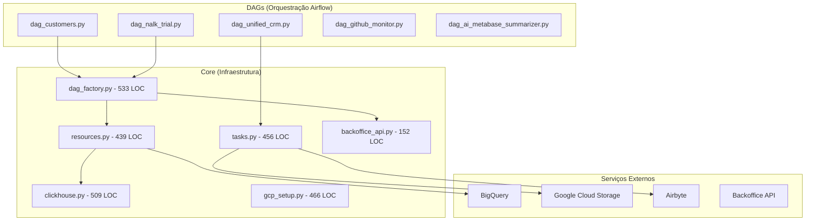
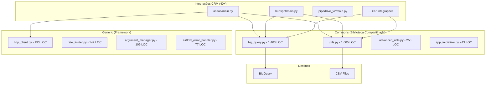
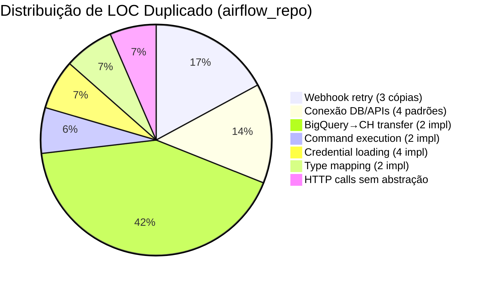
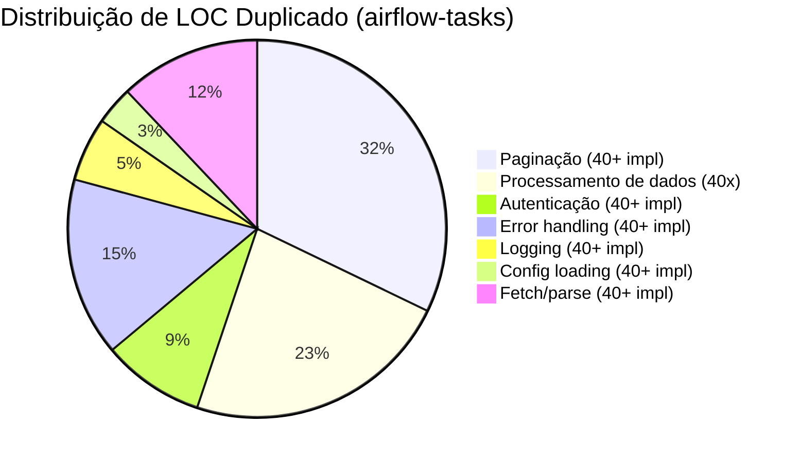
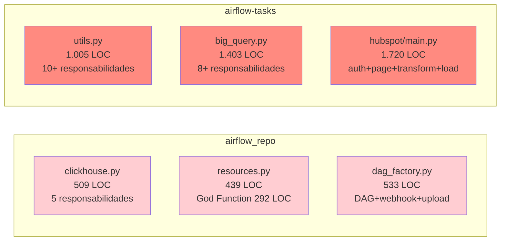
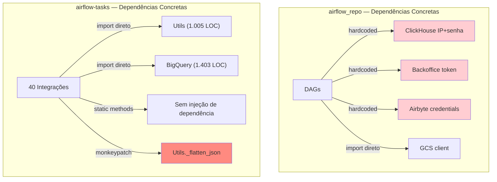
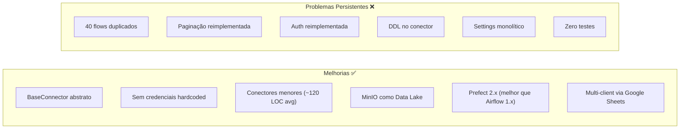
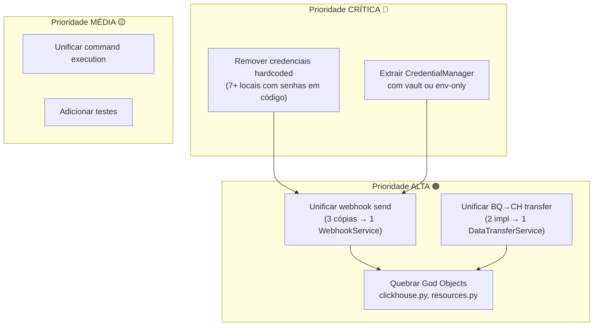
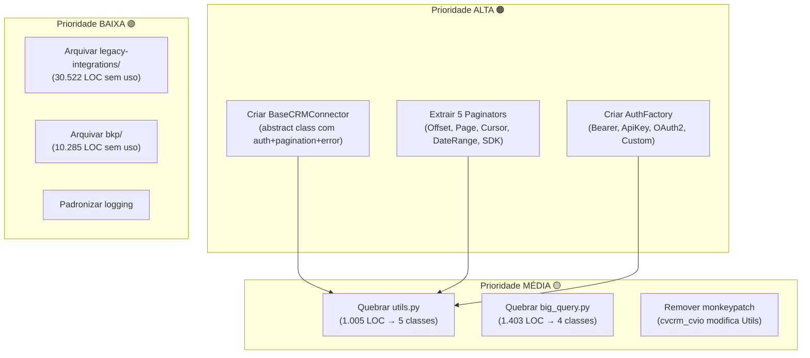
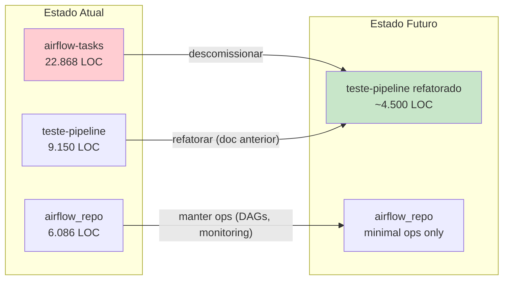

# Análise Arquitetural — Repositórios Legado

> **Objetivo**: Mapear redundâncias, violações SOLID e oportunidades de reuso nos pipelines legados.
> **Data**: 2026-03-13 | **Repositórios**: `airflow_repo` (6.086 LOC) + `airflow-tasks` (22.868 LOC ativo + 40.807 LOC legacy/bkp)

---

## Sumário

1. [Visão Geral dos Repositórios](#1-visão-geral-dos-repositórios)
2. [Mapa de Redundâncias — airflow_repo](#2-mapa-de-redundâncias--airflow_repo)
3. [Mapa de Redundâncias — airflow-tasks](#3-mapa-de-redundâncias--airflow-tasks)
4. [Violações SOLID](#4-violações-solid)
5. [Análise Cruzada: Legado vs teste-pipeline](#5-análise-cruzada-legado-vs-teste-pipeline)
6. [Tabela Comparativa de Redução de Código](#6-tabela-comparativa-de-redução-de-código)
7. [Recomendações](#7-recomendações)

---

## 1. Visão Geral dos Repositórios

### 1.1 Métricas Gerais

| Métrica | airflow_repo | airflow-tasks (ativo) | airflow-tasks (legacy+bkp) |
|---------|-------------|----------------------|---------------------------|
| Arquivos Python | 25 | ~80 | ~60 |
| LOC Total | 6.086 | 22.868 | 40.807 |
| Maior Arquivo | dag_factory.py (533) | hubspot/main.py (1.720) | vista_crm.py (3.317) |
| Código Duplicado (est.) | ~860 LOC (14%) | ~4.150 LOC (18%) | N/A (arquivado) |
| Credenciais Hardcoded | 7+ locais | 0 (usa env) | N/A |
| Testes | 0 | 6 arquivos | 0 |

### 1.2 Arquitetura do airflow_repo



### 1.3 Arquitetura do airflow-tasks



### 1.4 Top 10 Maiores Arquivos (Ambos Repos)

| # | Arquivo | Repo | LOC | Problemas |
|---|---------|------|-----|-----------|
| 1 | hubspot/main.py | airflow-tasks | 1.720 | God Object, 5+ responsabilidades |
| 2 | big_query.py | airflow-tasks | 1.403 | SRP violado, schema+load+transform |
| 3 | utils.py | airflow-tasks | 1.005 | 10+ responsabilidades, monolítico |
| 4 | google_ads_v2/main.py | airflow-tasks | 895 | SDK+transform+load misturados |
| 5 | pipedrive_v2/main.py | airflow-tasks | 681 | Paginação customizada complexa |
| 6 | dag_factory.py | airflow_repo | 533 | DAG creation+webhook+upload |
| 7 | clickhouse.py | airflow_repo | 509 | Connection+query+insert+types |
| 8 | active_campaign/main.py | airflow-tasks | 487 | Reimplementa padrões existentes |
| 9 | gcp_setup.py | airflow_repo | 466 | CLI wrapping monolítico |
| 10 | tasks.py | airflow_repo | 456 | Airbyte+DBT+setup misturados |

---

## 2. Mapa de Redundâncias — airflow_repo

### 2.1 Webhook com Retry (3 cópias)

O mesmo padrão de envio de webhook com retry aparece em **3 arquivos diferentes**:

| Arquivo | LOC do Bloco | Variação |
|---------|-------------|----------|
| `dags/core/backoffice_api.py` (L16-36) | 20 | Padrão base |
| `dags/ai/backoffice_api.py` (L239-281) | 42 | Adiciona lógica `nalk_trial_` |
| `dags/core/dag_factory.py` (L15-100) | 85 | Payload customizado |

```python
# BLOCO IDÊNTICO repetido 3x (com variações mínimas):
attempts = 1
max_attempts = 15
interval_between_attempts_secs = 60
while attempts <= max_attempts:
    response = requests.post(url=url, json=payload.model_dump(), headers=headers)
    try:
        response.raise_for_status()
    except Exception:
        logging.warning(f"Response => status_code={response.status_code}")
        time.sleep(interval_between_attempts_secs)
        attempts += 1
        continue
    return
raise Exception('Unable to send webhook')
```

### 2.2 Credenciais de Conexão (4 padrões)

| Serviço | Arquivo | Hardcoded? | Problema |
|---------|---------|-----------|----------|
| ClickHouse | clickhouse.py L19-22 | `'@NalkAPI2025DN'`, IP `162.243.210.51` | Senha e IP em código |
| Backoffice | backoffice_api.py L8-12 | `'KAo9Cz@m9mPwh*ajw4Z8_fUVu'` | Token em código |
| Encryption | encryption.py L6-7 | Key + IV hardcoded | Chaves criptográficas expostas |
| Airbyte | dag_customers.py L6-10 | Client ID + Secret | Credenciais em código |

### 2.3 Transferência de Dados BigQuery→ClickHouse (2 implementações)

| Arquivo | LOC | Abordagem |
|---------|-----|-----------|
| `resources.py` (L58-350) | 292 | CSV intermediário, paginação manual |
| `bigquery_to_clickhouse.py` (L1-70) | 70 | DataFrame direto |

**Funcionalidade idêntica**, implementada de formas diferentes. A versão em `resources.py` é um "God Function" de 292 linhas.

### 2.4 Execução de Comandos (2 implementações)

| Arquivo | Função | Retorno |
|---------|--------|---------|
| `utils.py` (L1-40) | `execute_command()` | `(exit_code, stdout, stderr)` |
| `cli.py` (L1-15) | `run_command()` | `bool` |

Mesma funcionalidade, interfaces incompatíveis.

### 2.5 Resumo de Duplicação — airflow_repo



---

## 3. Mapa de Redundâncias — airflow-tasks

### 3.1 Autenticação (40+ reimplementações)

Cada integração reimplementa `get_auth_headers()`:

```python
# asaas/main.py
def get_auth_headers(access_token):
    return {"access_token": access_token, "Content-Type": "application/json"}

# acert/main.py — CÓPIA IDÊNTICA
def get_auth_headers(access_token):
    return {"access_token": access_token, "Content-Type": "application/json"}

# clickup/main.py — VARIAÇÃO
def get_auth_headers(bearer_token, workspace_id):
    return {"Authorization": f"Bearer {bearer_token}", "x-workspace-id": workspace_id}

# active_campaign_crm/main.py — OUTRA VARIAÇÃO
headers = {"Api-Token": token}
```

**6 esquemas de autenticação** reimplementados independentemente:

| Esquema | Integrações | LOC Total Duplicado |
|---------|-------------|---------------------|
| Bearer Token | 16 | ~160 |
| API Key Header | 6 | ~60 |
| access_token Header | 8 | ~80 |
| OAuth2 (SDK) | 3 | ~30 |
| Custom Headers | 5 | ~50 |
| Basic Auth | 2 | ~20 |
| **Total** | **40** | **~400** |

### 3.2 Paginação (40+ reimplementações)

Cada integração reimplementa `fetch_page()`:

```python
# PADRÃO OFFSET (asaas, eduzz, clickup, etc.):
def fetch_page(http_client, endpoint, headers, offset):
    data = fetch_data(http_client, endpoint, headers, offset)
    items = data.get('data', [])
    has_more = data.get('hasMore', False)
    return items, has_more

# PADRÃO PAGE (belle, moskit, acert, etc.):
def fetch_page(endpoint, token, page=0):
    data = fetch_data(endpoint, token, page)
    items = data.get('data', [])
    return items, len(items) > 0

# PADRÃO CURSOR (moskit_v2, hubspot):
def fetch_page(endpoint, token, cursor=None):
    data = fetch_data(endpoint, token, cursor)
    items = data.get('data', [])
    next_cursor = data.get('next_page_token')
    return items, next_cursor
```

| Estratégia | Integrações | LOC Duplicado |
|------------|-------------|---------------|
| Offset | 15 | ~450 |
| Page | 18 | ~540 |
| Cursor/Token | 5 | ~150 |
| Date-range | 8 | ~240 |
| SDK nativo | 3 | ~90 |
| **Total** | **40+** | **~1.470** |

### 3.3 Pipeline de Processamento (40x repetido)

Cada integração segue a mesma sequência:

```python
# Repetido verbatim em 30+ integrações:
raw_data = fetch_all_pages(endpoint)
processed_data = Utils.process_and_save_data(raw_data, endpoint_name)
BigQuery.start_pipeline(args.PROJECT_ID, args.CRM_TYPE, table_name=table)
```

A cadeia de transformação `Utils._normalize_keys → _flatten_json → DataFrame → _convert_columns → _normalize_column_names → _remove_empty_columns → CSV → BigQuery` é chamada identicamente.

### 3.4 Monkeypatching de Utils (Anti-pattern)

```python
# cvcrm_cvio/main.py — MODIFICA Utils em runtime!
original_flatten_json = Utils._flatten_json
def patched_flatten_json(data, prefix='', sep='.'):
    # lógica customizada...
Utils._flatten_json = patched_flatten_json  # ← Runtime modification!
```

**Risco**: Altera comportamento global de `Utils` para todas as chamadas subsequentes.

### 3.5 God Objects

| Arquivo | LOC | Responsabilidades |
|---------|-----|-------------------|
| `commons/utils.py` | 1.005 | Flatten JSON, normalizar keys, converter tipos, processar CSV, limpar pastas, converter moeda brasileira, validar dados, merge chunks, batch processing, column detection |
| `commons/big_query.py` | 1.403 | Schema detection, type mapping BQ↔Python, CSV processing, table creation, data loading, timestamp conversion, timezone handling, partitioning, clustering |
| `hubspot/main.py` | 1.720 | Auth, pagination, 8 endpoints, field mapping, custom transforms, BigQuery loading |

### 3.6 Resumo de Duplicação — airflow-tasks



---

## 4. Violações SOLID

### 4.1 S — Single Responsibility



| Arquivo | Responsabilidades Misturadas |
|---------|------------------------------|
| `utils.py` | JSON flatten, key normalize, type convert, CSV save, column remove, currency convert, batch process, chunk merge, folder cleanup, ID detection |
| `big_query.py` | Schema detect, type map, CSV process, table create, data load, timestamp convert, timezone handle, partition, cluster |
| `clickhouse.py` | Connection manage, query exec, insert data, type map, batch insert, SQL escape |
| `resources.py` | BQ query, type map, CSV write, CH insert, metadata extract, customer setup |
| `hubspot/main.py` | OAuth, pagination, 8 endpoints, field map, transform, BQ load |

### 4.2 O — Open/Closed

**Adicionar nova integração no airflow-tasks requer:**

1. Copiar ~300-600 LOC de boilerplate de outra integração ❌
2. Reimplementar `get_auth_headers()` ❌
3. Reimplementar `fetch_page()` com paginação ❌
4. Reimplementar error handling ❌
5. Reimplementar main loop ❌

**Não há extensão sem duplicação.**

### 4.3 L — Liskov Substitution

Integrações não seguem interface comum:

```python
# Assinatura varia entre integrações:
fetch_page(http_client, endpoint, headers, offset)     # asaas
fetch_page(endpoint, token, page)                       # acert
fetch_page(endpoint, token, offset, params, debug_info) # active_campaign
fetch_page(endpoint, headers, next_page_token)          # moskit_v2
```

Impossível substituir uma pela outra.

### 4.4 I — Interface Segregation

```python
# Toda integração importa TUDO, mesmo sem precisar:
from commons.advanced_utils import AdvancedUtils     # Nem todas usam
from commons.app_inicializer import AppInitializer
from commons.big_query import BigQuery               # 1.403 LOC importados
from commons.memory_monitor import MemoryMonitor     # Raramente usado
from commons.report_generator import ReportGenerator # Raramente usado
from commons.utils import Utils                      # 1.005 LOC importados
from generic.argument_manager import ArgumentManager
from generic.http_client import HttpClient
from generic.rate_limiter import RateLimiter
```

### 4.5 D — Dependency Inversion



---

## 5. Análise Cruzada: Legado vs teste-pipeline

### 5.1 Problemas Herdados

O `teste-pipeline` **melhorou** em relação ao legado em vários aspectos, mas **herdou alguns anti-patterns**:

| Problema | airflow_repo | airflow-tasks | teste-pipeline |
|----------|-------------|---------------|----------------|
| Credenciais hardcoded | 7+ locais com senhas | Não (usa env) | Não (usa env + Prefect vars) |
| God Objects | clickhouse.py, resources.py | utils.py, big_query.py | Não (conectores são menores) |
| Flow/DAG duplicados | 5 DAGs distintos | 40+ main.py similares | 40 flows quase idênticos |
| Paginação reimplementada | N/A | 40+ implementações | 25+ implementações |
| Auth reimplementada | 4 padrões | 40+ implementações | 15+ implementações |
| Sem interface base | Sem base class | Sem base class | BaseConnector (mas mínimo) |
| Sem Strategy Pattern | Sem strategies | HttpClient existe mas subutilizado | Sem strategies |
| Testes | 0 | 6 arquivos | 0 |
| DDL acoplado a lógica | N/A | Schema em BigQuery | DDL dentro dos conectores |

### 5.2 O que o teste-pipeline melhorou



### 5.3 Comparação de Tamanho por Integração

| Integração | airflow-tasks (LOC) | teste-pipeline (LOC) | Redução |
|------------|---------------------|---------------------|---------|
| Asaas | 434 (main.py) | 179 (connector) + 97 (flow) = 276 | 36% |
| HubSpot | 1.720 (main.py) | 128 (connector) + 88 (flow) = 216 | 87% |
| Pipedrive | 681 (main.py) | 191 (connector) + 106 (flow) = 297 | 56% |
| Google Ads | 895 (main.py) | 134 (connector) + 121 (flow) = 255 | 71% |
| Active Campaign | 487 (main.py) | 68 (connector) + 72 (flow) = 140 | 71% |
| ClickUp | 695 (main_v2.py) | 149 (connector) + 100 (flow) = 249 | 64% |
| Learn Words | 445 (main.py) | 127 (connector) + 84 (flow) = 211 | 53% |
| **Média** | **~622** | **~235** | **~62%** |

O teste-pipeline já reduziu ~62% do código por integração, mas **a duplicação entre flows** limita ganhos futuros.

---

## 6. Tabela Comparativa de Redução de Código

### 6.1 airflow_repo — Refatorações Possíveis

| Refatoração | LOC Atual | LOC Proposto | Redução | Técnica |
|-------------|-----------|-------------|---------|---------|
| Unificar webhook retry (3→1) | 147 | 30 | 117 (80%) | Strategy + Retry decorator |
| Unificar BQ→CH transfer (2→1) | 362 | 100 | 262 (72%) | DataTransferService |
| Unificar command execution (2→1) | 55 | 25 | 30 (55%) | ProcessExecutor |
| Centralizar credenciais | 120 | 30 | 90 (75%) | CredentialManager + env |
| Quebrar clickhouse.py (509 LOC) | 509 | 250 | 259 (51%) | SRP: 3 classes |
| Quebrar resources.py (439 LOC) | 439 | 200 | 239 (54%) | SRP: 2-3 services |
| **Total** | **1.632** | **635** | **997 (61%)** | |

### 6.2 airflow-tasks — Refatorações Possíveis

| Refatoração | LOC Atual | LOC Proposto | Redução | Técnica |
|-------------|-----------|-------------|---------|---------|
| Auth abstraction (40→4 strategies) | 400 | 60 | 340 (85%) | AuthFactory + Strategy |
| Pagination abstraction (40→5) | 1.470 | 200 | 1.270 (86%) | BasePaginator + Strategy |
| Pipeline de processamento (40→1) | 1.050 | 100 | 950 (90%) | ETLPipeline |
| Error handling (40→1) | 700 | 80 | 620 (89%) | Decorator + HttpClient |
| Quebrar utils.py (1.005 LOC) | 1.005 | 600 | 405 (40%) | SRP: 5 classes |
| Quebrar big_query.py (1.403 LOC) | 1.403 | 700 | 703 (50%) | SRP: 4 classes |
| Config loading (40→1) | 150 | 30 | 120 (80%) | IntegrationConfig |
| Logging (40→1) | 250 | 50 | 200 (80%) | StructuredLogger |
| **Total** | **6.428** | **1.820** | **4.608 (72%)** | |

### 6.3 Consolidado dos 3 Repositórios

| Repositório | LOC Ativo | LOC Duplicado | LOC Eliminável | % Eliminável |
|-------------|-----------|---------------|----------------|-------------|
| airflow_repo | 6.086 | ~860 | ~997 | 16% |
| airflow-tasks | 22.868 | ~4.150 | ~4.608 | 20% |
| teste-pipeline | 9.150 | ~4.300 | ~4.650 | 51% |
| **Total** | **38.104** | **~9.310** | **~10.255** | **27%** |

> **Nota**: O teste-pipeline tem maior % eliminável porque seus flows são quase 100% boilerplate — eliminá-los tem o maior ROI.

---

## 7. Recomendações

### 7.1 Para o airflow_repo



### 7.2 Para o airflow-tasks



### 7.3 Estratégia de Consolidação

Dado que o `teste-pipeline` já substituiu as integrações do legado, o foco deveria ser:

1. **Não refatorar o legado** — está sendo substituído
2. **Aplicar os aprendizados no teste-pipeline** — implementar as abstrações que faltam no legado
3. **Descomissionar progressivamente** — à medida que integrações são validadas no teste-pipeline



### 7.4 O que Absorver do Legado no teste-pipeline

Apesar dos problemas arquiteturais, o legado tem **funcionalidades valiosas** ausentes no teste-pipeline:

| Feature do Legado | Onde Está | Status no teste-pipeline |
|-------------------|-----------|--------------------------|
| Rate Limiter configurável | `generic/rate_limiter.py` | Ausente — delay fixo por conector |
| Error Handler com retry inteligente | `generic/airflow_error_handler.py` | Ausente — apenas `@task(retries=3)` |
| Memory Monitor | `commons/memory_monitor.py` | Ausente |
| Webhook de status para Backoffice | `core/backoffice_api.py` | Ausente |
| Testes unitários | `commons/test/`, `generic/test/` | Ausente |
| JSON flatten robusto | `commons/utils.py` | Reimplementado parcialmente |
| Relational extraction | `commons/advanced_utils.py` | Ausente |
| Argument management | `generic/argument_manager.py` | N/A (Prefect params) |

---

## Apêndice A: Credenciais Expostas no airflow_repo

> **ALERTA DE SEGURANÇA**: Os valores abaixo foram encontrados hardcoded no código-fonte.

| Arquivo | Linha | Tipo | Valor (parcial) |
|---------|-------|------|-----------------|
| clickhouse.py | 22 | Password | `@NalkAPI2025DN` |
| clickhouse.py | 19 | Host IP | `162.243.210.51` |
| backoffice_api.py | 9 | Auth Token | `KAo9Cz@m9m...` |
| backoffice_api.py | 12 | Webhook Token | `dMfM@9Fsy...` |
| encryption.py | 6 | AES Key | `Lfo@kayc...` |
| encryption.py | 7 | AES IV | `p3verRq4...` |
| dag_customers.py | 7 | Airbyte Secret | `yWzCYI3N...` |

**Recomendação**: Rotacionar todas essas credenciais imediatamente e mover para secret manager.

## Apêndice B: Código Morto

| Diretório | Arquivos | LOC | Uso |
|-----------|----------|-----|-----|
| `airflow-tasks/legacy-integrations/` | 32 | 30.522 | Nenhum (deprecated) |
| `airflow-tasks/bkp/` | ~20 | 10.285 | Nenhum (backup) |
| **Total código morto** | **~52** | **40.807** | **Zero** |

**63% do LOC total do airflow-tasks é código morto.**
