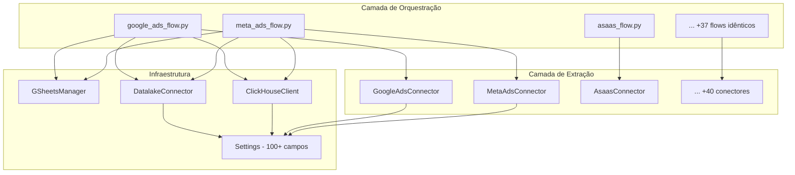
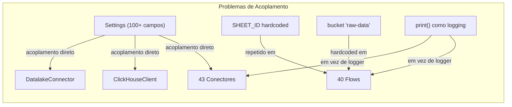
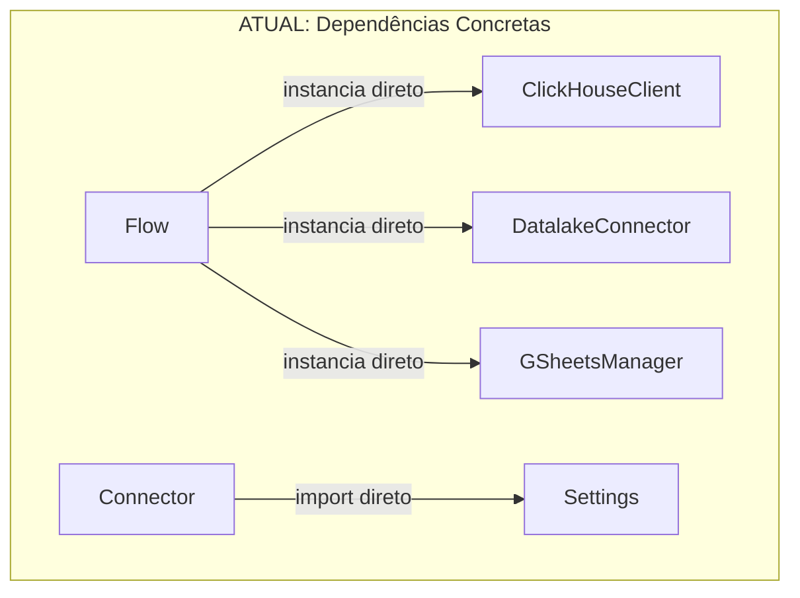
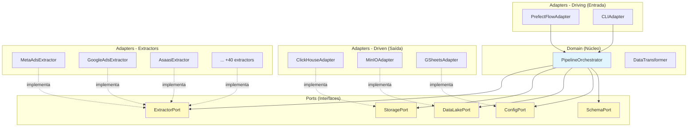
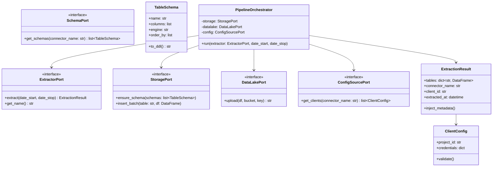
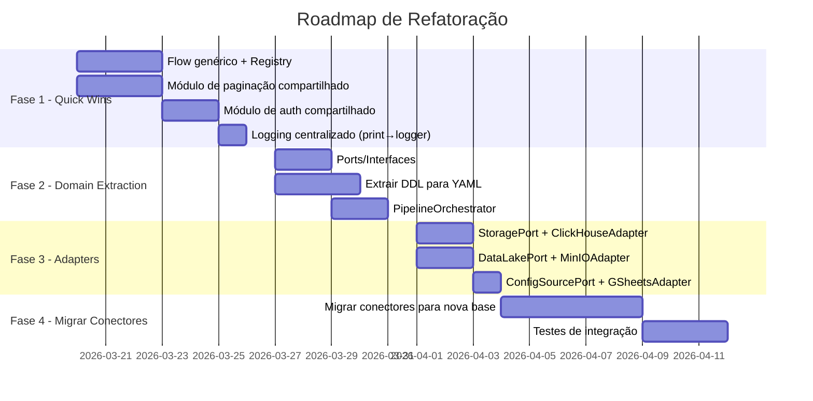
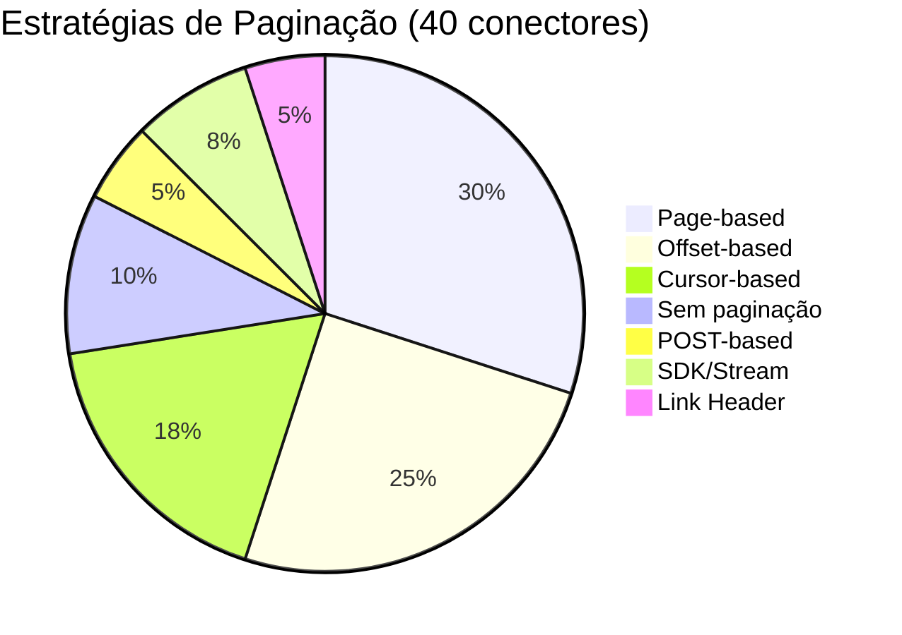
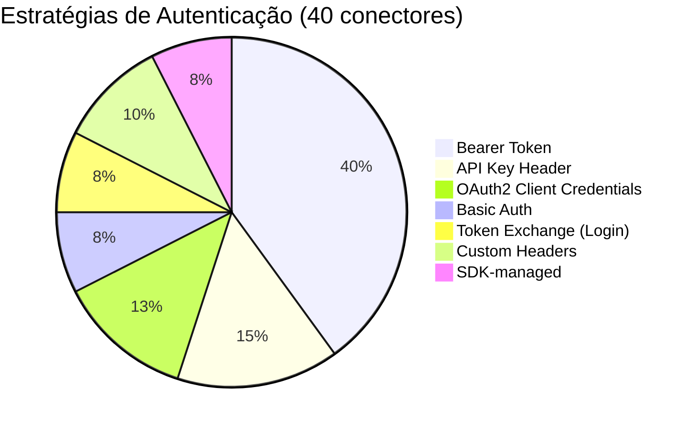

# Análise Arquitetural — teste-pipeline

> **Objetivo**: Identificar redundâncias, oportunidades de reuso e melhorias aplicando SOLID, DDD e Arquitetura Hexagonal.
> **Data**: 2026-03-13 | **Escopo**: 43 conectores, 40 flows, ~9.000 LOC

---

## Sumário

1. [Diagnóstico Geral](#1-diagnóstico-geral)
2. [Mapa de Redundâncias](#2-mapa-de-redundâncias)
3. [Violações SOLID](#3-violações-solid)
4. [Proposta: Arquitetura Hexagonal + DDD](#4-proposta-arquitetura-hexagonal--ddd)
5. [Refatorações Detalhadas](#5-refatorações-detalhadas)
6. [Tabela Comparativa de Redução de Código](#6-tabela-comparativa-de-redução-de-código)
7. [Roadmap de Implementação](#7-roadmap-de-implementação)

---

## 1. Diagnóstico Geral

### 1.1 Métricas Atuais

| Métrica | Valor |
|---------|-------|
| Conectores (`connectors/`) | 43 arquivos, ~5.200 LOC |
| Flows (`flows/`) | 40 arquivos, ~3.600 LOC |
| Infraestrutura (`base.py`, `datalake.py`, `clickhouse_client.py`, `settings.py`) | ~350 LOC |
| **Total** | **~9.150 LOC** |
| Código duplicado estimado (flows) | ~70% (~2.500 LOC) |
| Código duplicado estimado (conectores) | ~35% (~1.800 LOC) |
| **LOC redundante total** | **~4.300 LOC (47%)** |

### 1.2 Arquitetura Atual



**Problema central**: Cada flow reimplementa a mesma lógica de orquestração (GSheetsManager → create_tables → loop clients → extract → load). São 40 cópias quase idênticas.

---

## 2. Mapa de Redundâncias

### 2.1 Flows: Blocos de Código Duplicados

Cada flow contém **5 blocos idênticos** que se repetem em 37 dos 40 arquivos:

| Bloco | Descrição | LOC/flow | Total Duplicado |
|-------|-----------|----------|-----------------|
| **Extract Task** | `@task` + inject `project_id` + cast `object→str` | 15 | 555 |
| **Create Tables Task** | `ClickHouseClient()` + `run_ddl()` | 6 | 222 |
| **Load Task** | S3 upload + ClickHouse insert + fallback | 18 | 666 |
| **Pipeline Loop** | GSheetsManager → filter clients → loop | 25 | 925 |
| **Date Parsing** | `strptime` + default `timedelta` | 6 | 222 |
| **Total** | | **~70 LOC** | **~2.590 LOC** |

#### Exemplo: Bloco "Load Task" (idêntico em 37 flows)

```python
# Este bloco se repete EXATAMENTE em 37 arquivos, mudando apenas o nome do conector na string
@task
def load_to_clickhouse(data_dict: dict, credentials: dict, dt_stop: datetime):
    ch = ClickHouseClient()
    lake = DatalakeConnector()
    company_name = credentials.get("project_id", "unknown")
    date_path = dt_stop.strftime("%Y%m%d")

    for table_name, df in data_dict.items():
        if not df.empty:
            bucket = "raw-data"
            s3_key = f"CONECTOR/{company_name}/{table_name}_run_{date_path}.parquet"
            s3_url = lake.push_dataframe_to_parquet(df, bucket, s3_key)
            if s3_url:
                try:
                    ch.insert_from_s3(table_name, s3_url)
                except Exception as err:
                    ch.insert_dataframe(table_name, df)
```

### 2.2 Conectores: Padrões de Paginação Reimplementados

5 estratégias de paginação implementadas independentemente em cada conector:

| Estratégia | Conectores | Implementações Independentes | LOC Total Duplicado |
|------------|------------|------------------------------|---------------------|
| **Offset-based** (`offset/limit`) | Asaas, Brevo, Mautic, Digisac, Eduzz, Leads2b, PayTour, RD Marketing | 8 | ~240 |
| **Page-based** (`page/per_page`) | Ploomes, Superlogica, C2S, Groner, Arbo, CVCRM, Acert, Everflow | 8 | ~240 |
| **Cursor-based** (`cursor/nextLink`) | Pipedrive, HubSpot, Shopify, Imobzi, Clicksign, Vindi | 6 | ~180 |
| **Token-based** (header token) | Moskit | 1 | ~30 |
| **POST-based** | Omie, Sigavi | 2 | ~60 |
| **Total** | | **25** | **~750 LOC** |

### 2.3 Conectores: Helpers Reimplementados

| Helper | Implementações | Conectores |
|--------|----------------|------------|
| `_headers()` → dict estático | 15+ | Quase todos |
| `_safe_request()` com retry | 3 | RD Marketing, RDCRM, Hotmart |
| `_flatten_dict()` / `_flatten_json()` | 6 | Hotmart, RD Marketing, Pipedrive, Shopify, Omie, PayTour |
| `_normalize_name()` | 2 | Pipedrive, RDCRM |
| `_clean_text_data()` | 3 | Pipedrive, ClickUp, Hotmart |
| Conversão de datas (formatos) | 5+ | Variados |

### 2.4 Infraestrutura: Acoplamentos



---

## 3. Violações SOLID

### 3.1 S — Single Responsibility (Violado)

| Classe | Responsabilidades Atuais | Deveria |
|--------|--------------------------|---------|
| `BaseConnector` | Extração + DDL do ClickHouse | Separar Domain (extração) de Infrastructure (DDL) |
| `Settings` | 100+ credenciais em 1 classe | Separar por domínio/plataforma |
| Cada Flow | Orquestração + Transformação + Loading + Config | Delegar para serviços especializados |

**Exemplo**: O conector `AsaasConnector` conhece tanto a API do Asaas quanto a estrutura de tabelas ClickHouse:

```python
class AsaasConnector(BaseConnector):
    def extract(self, ...):         # ← Responsabilidade 1: API/Domínio
        ...
    def get_tables_ddl(self) -> list:  # ← Responsabilidade 2: Infraestrutura/DB
        return ["CREATE TABLE IF NOT EXISTS asaas_payments (...)"]
```

### 3.2 O — Open/Closed (Violado)

Para adicionar um novo conector, é necessário:
1. Criar `connectors/novo.py` ✅ (extensão)
2. Criar `flows/novo_flow.py` com 80-100 linhas de boilerplate ❌ (repetição)
3. Modificar `config/settings.py` ❌ (modificação)
4. Adicionar deployment em `prefect.yaml` ❌ (modificação)

**Ideal**: Apenas criar o conector + um arquivo de configuração.

### 3.3 L — Liskov Substitution (Parcialmente Violado)

O `extract()` retorna `dict[str, DataFrame]` sem contrato tipado. Cada conector retorna chaves diferentes, e os flows assumem chaves específicas sem validação.

### 3.4 I — Interface Segregation (Violado)

`BaseConnector` mistura duas interfaces:
- **Extração de dados** (`extract`)
- **Definição de schema** (`get_tables_ddl`)

Nem todo conector precisa definir DDL (ex: cenários de teste ou multi-warehouse).

### 3.5 D — Dependency Inversion (Violado)



Todos os módulos dependem de implementações concretas. Não há interfaces/abstrações para:
- Storage (ClickHouse é fixo)
- Data Lake (MinIO é fixo)
- Config Source (Google Sheets é fixo)

---

## 4. Proposta: Arquitetura Hexagonal + DDD

### 4.1 Visão Geral



### 4.2 Estrutura de Diretórios Proposta

```
teste-pipeline/
├── domain/                          # Núcleo do negócio
│   ├── ports/                       # Interfaces (contratos)
│   │   ├── extractor.py             # ExtractorPort
│   │   ├── storage.py               # StoragePort (warehouse)
│   │   ├── datalake.py              # DataLakePort
│   │   ├── config_source.py         # ConfigSourcePort
│   │   └── schema.py               # SchemaPort
│   ├── models/                      # Value Objects e Entities
│   │   ├── extraction_result.py     # ExtractionResult (tipado)
│   │   ├── client_config.py         # ClientConfig (credenciais)
│   │   └── table_schema.py          # TableSchema (DDL abstrato)
│   ├── services/                    # Lógica de negócio
│   │   ├── pipeline_orchestrator.py # O ÚNICO pipeline genérico
│   │   └── data_transformer.py      # Transformações compartilhadas
│   └── exceptions.py               # Exceções de domínio
│
├── adapters/                        # Implementações concretas
│   ├── extractors/                  # Conectores de API (1 por plataforma)
│   │   ├── base_http.py             # Mixin HTTP com paginação
│   │   ├── pagination/              # Estratégias de paginação
│   │   │   ├── offset.py
│   │   │   ├── page.py
│   │   │   ├── cursor.py
│   │   │   └── post.py
│   │   ├── auth/                    # Estratégias de autenticação
│   │   │   ├── bearer.py
│   │   │   ├── api_key.py
│   │   │   ├── oauth2.py
│   │   │   └── basic.py
│   │   ├── meta_ads.py
│   │   ├── google_ads.py
│   │   └── ... (40 extractors)
│   ├── storage/
│   │   └── clickhouse.py           # Implementa StoragePort
│   ├── datalake/
│   │   └── minio.py                # Implementa DataLakePort
│   ├── config/
│   │   └── gsheets.py              # Implementa ConfigSourcePort
│   └── orchestration/
│       └── prefect_flow.py          # O ÚNICO arquivo de flow
│
├── config/
│   ├── settings.py                  # Apenas infra (CH, MinIO, Prefect)
│   └── connectors/                  # Config por conector (YAML)
│       ├── meta_ads.yaml
│       ├── google_ads.yaml
│       └── ...
│
└── prefect.yaml
```

### 4.3 Domain Model (DDD)



---

## 5. Refatorações Detalhadas

### 5.1 Eliminação dos 40 Flows → 1 Flow Genérico

**Antes** (40 arquivos, ~3.600 LOC):
```python
# flows/asaas_flow.py (97 linhas) — repetido 40x com variações mínimas
@flow(name="Asaas to ClickHouse")
def asaas_pipeline(date_start=None, date_stop=None):
    SHEET_ID = "1ZA4rVPpHqDNvdw7t1gajgoCeV1uAaIM_sdI90BUCKIE"
    GID = "0"
    manager = GSheetsManager(sheet_id=SHEET_ID)
    clients = manager.get_tab_data(gid=GID)
    # ... 80 linhas de boilerplate ...
```

**Depois** (1 arquivo + registro, ~150 LOC total):
```python
# adapters/orchestration/prefect_flow.py
from domain.services.pipeline_orchestrator import PipelineOrchestrator

CONNECTOR_REGISTRY = {
    "meta_ads":    {"class": MetaAdsExtractor,    "gid": "1615208458", "default_days": 2},
    "google_ads":  {"class": GoogleAdsExtractor,  "gid": "380179982",  "default_days": 2},
    "asaas":       {"class": AsaasExtractor,      "gid": "0",          "default_days": 30},
    # ... 40 entradas de 1 linha cada
}

@flow(name="Generic ETL Pipeline")
def run_pipeline(connector_name: str, date_start: str = None, date_stop: str = None):
    config = CONNECTOR_REGISTRY[connector_name]
    orchestrator = PipelineOrchestrator(
        storage=ClickHouseAdapter(),
        datalake=MinIOAdapter(),
        config_source=GSheetsAdapter(sheet_id=SHEET_ID),
    )
    extractor_class = config["class"]
    orchestrator.run(
        extractor_class=extractor_class,
        connector_name=connector_name,
        gid=config["gid"],
        date_start=date_start,
        date_stop=date_stop,
        default_days=config["default_days"],
    )
```

### 5.2 Estratégias de Paginação como Strategy Pattern

**Antes** (reimplementado 25x, ~750 LOC):
```python
# connectors/asaas.py — offset pagination
def _fetch_all_pages(self, endpoint):
    offset = 0
    while True:
        params = {"limit": 100, "offset": offset}
        resp = requests.get(url, headers=self._headers(), params=params)
        items = resp.json().get("data", [])
        if not items: break
        all_items.extend(items)
        offset += 100

# connectors/arbo.py — page pagination (MESMA LÓGICA, nomes diferentes)
def _fetch_paginated(self, endpoint):
    page = 1
    while True:
        params = {"page": page, "perPage": 500}
        resp = requests.get(url, headers=self._headers(), params=params)
        items = resp.json().get("data", [])
        if not items: break
        all_items.extend(items)
        page += 1
```

**Depois** (~100 LOC no módulo de paginação):
```python
# adapters/extractors/pagination/offset.py
class OffsetPagination:
    def __init__(self, limit=100, offset_param="offset", limit_param="limit",
                 items_key="data", has_more_key="hasMore", delay=0.2):
        ...

    def fetch_all(self, session, url, headers, extra_params=None) -> list:
        all_items, offset = [], 0
        while True:
            params = {self.offset_param: offset, self.limit_param: self.limit}
            resp = session.get(url, headers=headers, params={**params, **(extra_params or {})})
            data = resp.json()
            items = self._extract_items(data)
            if not items: break
            all_items.extend(items)
            if not data.get(self.has_more_key, True): break
            offset += self.limit
            time.sleep(self.delay)
        return all_items

# Uso no conector:
class AsaasExtractor(BaseHTTPExtractor):
    pagination = OffsetPagination(limit=100, items_key="data", has_more_key="hasMore")
    auth = BearerAuth(token_field="access_token")
```

### 5.3 Autenticação como Strategy Pattern

**Antes** (15+ implementações de `_headers()`):
```python
# connectors/brevo.py
def _headers(self):
    return {"api-key": self.api_key, "Content-Type": "application/json"}

# connectors/asaas.py
def _headers(self):
    return {"access_token": self.access_token, "Content-Type": "application/json"}

# connectors/ploomes.py
def _headers(self):
    return {"User-Key": self.user_key, "Content-Type": "application/json"}
```

**Depois** (~50 LOC):
```python
# adapters/extractors/auth/strategies.py
class BearerAuth:
    def __init__(self, token, header_name="Authorization", prefix="Bearer"):
        self.headers = {header_name: f"{prefix} {token}" if prefix else token}
    def apply(self, headers): return {**headers, **self.headers}

class ApiKeyAuth:
    def __init__(self, key, header_name="api-key"):
        self.headers = {header_name: key}
    def apply(self, headers): return {**headers, **self.headers}

class OAuth2ClientCredentials:
    def __init__(self, client_id, client_secret, token_url):
        self.token = self._fetch_token(client_id, client_secret, token_url)
    def apply(self, headers): return {**headers, "Authorization": f"Bearer {self.token}"}
```

### 5.4 Separar DDL dos Conectores (Interface Segregation)

**Antes**: DDL acoplado ao conector
```python
class AsaasConnector(BaseConnector):
    def extract(self, ...): ...        # API logic
    def get_tables_ddl(self) -> list:   # ClickHouse SQL — por que aqui?
        return ["CREATE TABLE IF NOT EXISTS asaas_payments (...)"]
```

**Depois**: Schemas em YAML separados
```yaml
# config/schemas/asaas.yaml
tables:
  - name: asaas_payments
    order_by: [id]
    columns:
      - {name: id, type: String}
      - {name: customer, type: String}
      - {name: value, type: Float64}
      - {name: status, type: String}
      - {name: project_id, type: String, default: "''"}
      - {name: updated_at, type: DateTime, default: "now()"}
```

### 5.5 Settings Segmentado por Domínio

**Antes** (1 classe com 100+ campos):
```python
class Settings(BaseSettings):
    meta_app_id: Optional[str] = None
    meta_app_secret: Optional[str] = None
    # ... 95 campos mais ...
    learn_words_client_secret: Optional[str] = None
```

**Depois** (settings apenas de infra + config por conector):
```python
# config/settings.py — apenas infraestrutura (~20 campos)
class Settings(BaseSettings):
    clickhouse_host: str = "localhost"
    clickhouse_port: int = 8123
    clickhouse_user: str = "nalk_worker"
    clickhouse_password: str = ""
    clickhouse_database: str = "marketing"
    minio_endpoint: str = "http://localhost:9000"
    minio_external_endpoint: str = "http://minio:9000"
    minio_access_key: str = "admin"
    minio_secret_key: str = ""
    gsheets_sheet_id: str = ""
    raw_data_bucket: str = "raw-data"

# Credenciais vêm do Google Sheets (já funciona assim!)
# O settings.py atual serve apenas como fallback — pode ser eliminado por plataforma
```

---

## 6. Tabela Comparativa de Redução de Código

### 6.1 Por Camada

| Camada | Atual (LOC) | Proposto (LOC) | Redução | Redução % |
|--------|-------------|----------------|---------|-----------|
| **Flows** (40 arquivos) | 3.600 | 200 (1 arquivo + registry) | 3.400 | **94%** |
| **Conectores** (43 arquivos) | 5.200 | 3.200 (com mixins de paginação/auth) | 2.000 | **38%** |
| **Infraestrutura** | 350 | 500 (ports + adapters) | -150 | +43% (investimento) |
| **Schemas** (novo, YAML) | 0 | 400 (extraído dos conectores) | — | — |
| **Domain Services** (novo) | 0 | 200 (orchestrator + transformer) | — | — |
| **Total** | **9.150** | **4.500** | **4.650** | **~51%** |

### 6.2 Por Tipo de Redundância Eliminada

| Redundância | Instâncias | LOC Eliminado | Técnica |
|-------------|------------|---------------|---------|
| Flow boilerplate (extract/load/loop) | 37 cópias → 1 | ~2.500 | Generic Pipeline + Registry |
| Paginação reimplementada | 25 → 4 estratégias | ~650 | Strategy Pattern |
| `_headers()` duplicado | 15 → 4 strategies | ~100 | Auth Strategy |
| `_flatten_dict()` reimplementado | 6 → 1 | ~100 | Utility compartilhado |
| DDL inline em conectores | 43 → YAML | ~600 | Schema-as-Config |
| Settings monolítico | 100+ campos → ~20 | ~100 | Separação de concerns |
| **Total Eliminado** | | **~4.050** | |

### 6.3 Impacto na Manutenção

| Cenário | Hoje | Proposto |
|---------|------|----------|
| Adicionar novo conector | 3 arquivos + 2 edits (~180 LOC) | 1 arquivo + 1 YAML + 1 linha no registry (~80 LOC) |
| Corrigir bug no load/S3 | Editar 40 flows | Editar 1 arquivo |
| Mudar warehouse (CH → Postgres) | Reescrever 43 `get_tables_ddl()` + `clickhouse_client.py` | Implementar 1 novo `StoragePort` adapter |
| Mudar config source (Sheets → DB) | Reescrever 40 flows | Implementar 1 novo `ConfigSourcePort` adapter |
| Alterar formato de logging | Editar 83 arquivos (`print()`) | Editar 1 logger centralizado |
| Adicionar retry global | Editar 40 flows | Editar 1 `PipelineOrchestrator` |

---

## 7. Roadmap de Implementação

### Fase 1: Quick Wins (baixo risco, alto impacto)



#### 1.1 Flow Genérico + Connector Registry
- **Impacto**: Elimina 3.400 LOC de duplicação
- **Risco**: Baixo (manter flows antigos como fallback)
- **O que fazer**: Criar `generic_pipeline_flow.py` com toda a lógica compartilhada e um dicionário de registro por conector

#### 1.2 Módulo de Paginação
- **Impacto**: Elimina ~650 LOC
- **Risco**: Baixo (adicionar como mixin opcional)
- **O que fazer**: Extrair 4 classes de paginação (`OffsetPagination`, `PagePagination`, `CursorPagination`, `PostPagination`)

#### 1.3 Módulo de Autenticação
- **Impacto**: Elimina ~100 LOC, padroniza auth
- **Risco**: Baixo
- **O que fazer**: Extrair strategies `BearerAuth`, `ApiKeyAuth`, `OAuth2Auth`, `BasicAuth`

### Fase 2: Domain Extraction (médio risco)

- Criar diretório `domain/` com ports e models
- Extrair DDL de 43 conectores para YAML
- Criar `PipelineOrchestrator` que concentra a lógica de ETL

### Fase 3: Adapters (médio risco)

- Implementar adapters que satisfazem os ports
- Permitir troca de warehouse/datalake/config sem alterar domínio

### Fase 4: Migração dos Conectores (alto risco, incremental)

- Migrar um conector por vez para a nova base
- Manter backwards compatibility durante migração
- Testes de integração após cada migração

---

## Apêndice A: Conectores por Tamanho (LOC)

| Conector | LOC | Paginação | Auth | Tabelas |
|----------|-----|-----------|------|---------|
| ploomes.py | 264 | Cursor (OData) | User-Key | 15 |
| hotmart.py | 260 | Cursor | OAuth2 | 4 |
| paytour.py | 244 | Page | Basic Auth | 5 |
| piperun.py | 219 | Page | Bearer | 6 |
| rd_marketing.py | 198 | Offset | OAuth2 | 3 |
| pipedrive.py | 191 | Dual (v1/v2) | Bearer | 10 |
| shopify.py | 181 | Cursor (Link) | Token Header | 3 |
| asaas.py | 179 | Offset | Token Header | 4 |
| omie.py | 168 | POST | Key+Secret | 2 |
| clickup.py | 149 | CSV Export | Bearer | 1 |
| eduzz.py | 148 | Page | Bearer | 4 |
| groner.py | 139 | Page | Bearer | 10 |
| leads2b.py | 137 | Page | Bearer | 2 |
| acert.py | 136 | Page (0-indexed) | Token | 9 |
| rdcrm.py | 134 | Page | Bearer | 3 |
| google_ads.py | 134 | Stream (SDK) | OAuth2 | 2 |
| hubspot.py | 128 | Cursor | OAuth2 | 2 |
| digisac.py | 128 | Page | Bearer | 3 |
| learn_words.py | 127 | Page | OAuth2 | 7 |
| silbeck.py | 120 | Nenhuma | Bearer | 2 |
| clicksign.py | 116 | Page + Link | Bearer | 3 |
| meta_ads.py | 115 | SDK Iterator | SDK Init | 2 |
| belle.py | 115 | Date Chunk | Token | 6 |
| sigavi.py | 110 | POST | Form POST | 1 |
| c2s.py | 107 | Page (6s delay) | Bearer | 4 |
| moskit.py | 106 | Token (Header) | API Key | 7 |
| arbo.py | 104 | Page | Bearer (2 APIs) | 2 |
| everflow.py | 103 | Page + Toggle | Bearer | 15 |
| mautic.py | 102 | Offset | OAuth2 | 3 |
| hypnobox.py | 101 | Page | Token Exchange | 5 |
| brevo.py | 101 | Offset | API Key | 2 |
| evo.py | 99 | Offset (skip/take) | Basic Auth | 8 |
| vindi.py | 97 | Link Header | Basic Auth | 3 |
| facilita.py | 97 | Nenhuma | Custom Headers | 3 |
| superlogica.py | 92 | Page (1-indexed) | Dual Token | 5 |
| imobzi.py | 92 | Cursor | Secret Header | 9 |
| cvcrm_cvio.py | 78 | Offset | Email+Token | 1 |
| cvcrm_cvdw.py | 76 | Page | Email+Token | 5 |
| native.py | 71 | Nenhuma | Token Login | 1 |
| active_campaign.py | 68 | Offset | API Key | 2 |

## Apêndice B: Distribuição de Paginação



## Apêndice C: Distribuição de Autenticação


