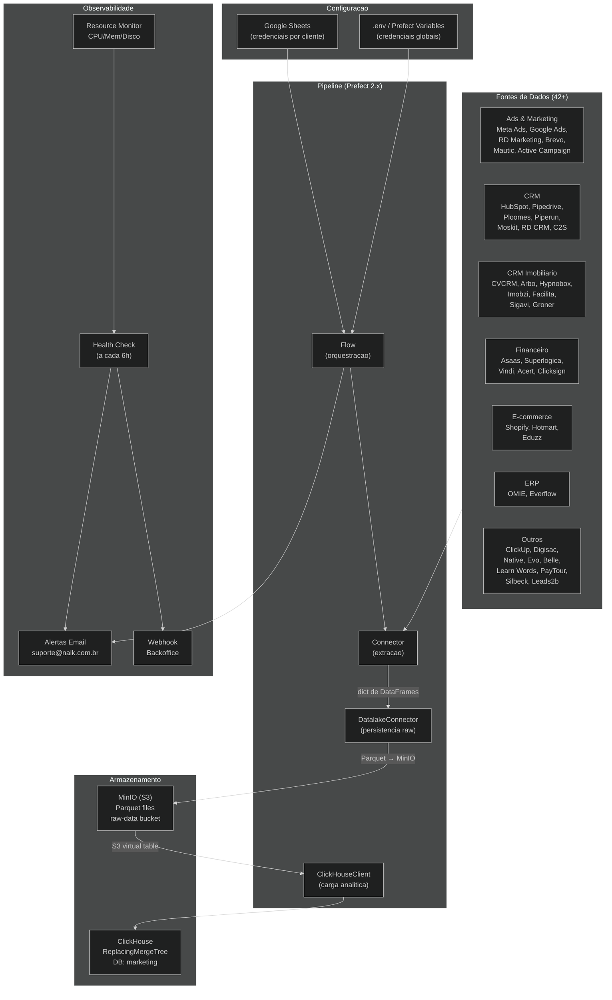
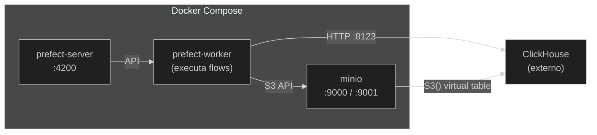
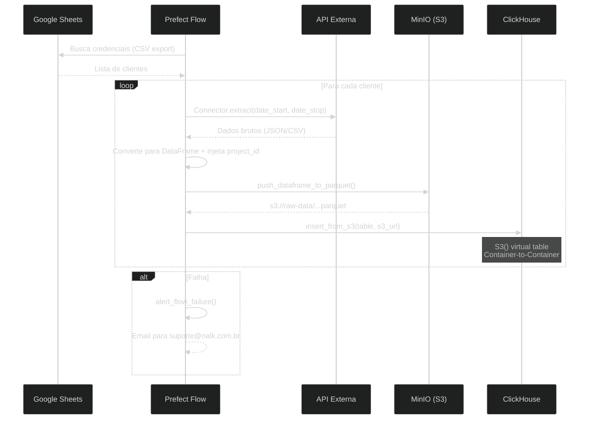

# Visao Geral da Arquitetura - Nalk Data Pipeline

> **Documento tecnico para entender como o pipeline de dados funciona de ponta a ponta.**

---

## Resumo Executivo

O Nalk Data Pipeline e uma plataforma de integracao de dados multi-tenant que conecta **42+ fontes de dados** (CRMs, plataformas de marketing, ERPs, e-commerce) a um data warehouse analitico. Ele substitui o pipeline legado baseado em Apache Airflow por uma arquitetura moderna com **Prefect 2.x**, **MinIO** e **ClickHouse**.

---

## Diagrama de Arquitetura



---

## Stack Tecnologica

| Camada | Tecnologia | Proposito |
|--------|-----------|-----------|
| **Orquestracao** | Prefect 2.x | Agendamento, retry, monitoramento de flows |
| **Data Lake** | MinIO (S3-compatible) | Armazenamento de dados brutos em Parquet |
| **Data Warehouse** | ClickHouse | Banco colunar OLAP para analytics |
| **Configuracao** | Pydantic Settings + Google Sheets | Gestao centralizada de credenciais |
| **Containerizacao** | Docker + Docker Compose | Isolamento e deploy |
| **CI/CD** | GitHub Actions | Lint, compile, build, deploy |
| **Linguagem** | Python 3.11+ | Runtime principal |

---

## Componentes Principais

### 1. Conectores (`connectors/`)

Cada conector herda de `BaseConnector` e implementa dois metodos:

```python
class BaseConnector(ABC):
    @abstractmethod
    def extract(self, date_start, date_stop) -> dict:
        """Retorna {"tabela": DataFrame, ...}"""

    @abstractmethod
    def get_tables_ddl(self) -> list:
        """Retorna lista de SQL CREATE TABLE para ClickHouse"""
```

**42 conectores** organizados por categoria:

| Categoria | Qtd | Conectores |
|-----------|-----|-----------|
| Ads & Marketing | 6 | Meta Ads, Google Ads, RD Marketing, Brevo, Mautic, Active Campaign |
| CRM | 8 | HubSpot, Pipedrive, Ploomes, Piperun, Moskit, RD CRM, C2S, Leads2b |
| CRM Imobiliario | 8 | CVCRM CVDW, CVCRM CVIO, Arbo, Hypnobox, Imobzi, Facilita, Sigavi, Groner |
| E-commerce | 3 | Shopify, Hotmart, Eduzz |
| Financeiro | 5 | Asaas, Superlogica, Vindi, Acert, Clicksign |
| ERP | 2 | OMIE, Everflow |
| Outros | 10 | ClickUp, Digisac, Native, Evo, Belle, Learn Words, PayTour, Silbeck, Leads2b |

### 2. Flows (`flows/`)

Cada flow segue o padrao:

1. **Ler configuracao** → `GSheetsManager` busca credenciais de clientes
2. **Criar tabelas** → `ClickHouseClient.run_ddl()`
3. **Loop por cliente** → Para cada cliente na planilha:
   - `Connector.extract()` → dict de DataFrames
   - `DatalakeConnector.push_dataframe_to_parquet()` → Parquet no MinIO
   - `ClickHouseClient.insert_from_s3()` → Carga no ClickHouse
4. **Tratamento de erro** → Log + alerta em caso de falha

### 3. Infraestrutura (`config/`, `scripts/`)

- **Settings** (`config/settings.py`): Pydantic BaseSettings com 170+ campos, suporte a `.env`, variaveis de ambiente e Prefect Variables
- **GSheetsManager** (`scripts/gsheets_manager.py`): Leitura de credenciais multi-cliente via Google Sheets CSV export
- **Alerting** (`scripts/alerting.py`): Notificacao por email via SMTP
- **Monitor** (`scripts/monitor.py`): Monitoramento de CPU, memoria e disco
- **Webhook** (`scripts/webhook_notifier.py`): Notificacao de status para backoffice

---

## Infraestrutura Docker



| Servico | Porta | Descricao |
|---------|-------|-----------|
| `prefect-server` | 4200 | API e UI do Prefect |
| `prefect-worker` | - | Worker que executa os flows |
| `minio` | 9000 / 9001 | Object storage (API / Console) |
| ClickHouse | 8123 | Data warehouse (externo ao compose) |

---

## Fluxo de Dados



---

## Modelo de Multi-Tenancy

O pipeline suporta **multiplos clientes** para cada integracao:

```
Google Sheets (planilha publica)
├── Aba "Meta Ads" (GID: 1615208458)
│   ├── Cliente A: {project_id, access_token, accounts_ids, ...}
│   ├── Cliente B: {project_id, access_token, accounts_ids, ...}
│   └── Cliente C: ...
├── Aba "HubSpot" (GID: xxx)
│   ├── Cliente D: {project_id, api_key, ...}
│   └── ...
└── ...
```

Cada linha na aba = 1 cliente. O flow itera sobre todos e processa em sequencia.

---

## Hierarquia de Configuracao

O sistema busca credenciais em 3 niveis (prioridade decrescente):

```
1. Prefect Variables (UI)     → Dinamico, sem redeploy
2. Variavel de Ambiente (.env) → Definido no deploy
3. Google Sheets              → Gerenciado pela equipe de CS
```

O metodo `settings.get(key)` implementa essa cascata automaticamente.

---

## Repositorios

| Repositorio | Status | Descricao |
|-------------|--------|-----------|
| `teste-pipeline` (este) | **Ativo** | Pipeline canonico com Prefect 2.x |
| `airflow` (legado) | Deprecated | Orquestrador Airflow antigo |
| `airflow-tasks` (legado) | Deprecated | Extratores Docker individuais |

---

*Documentacao atualizada em Marco 2026.*
