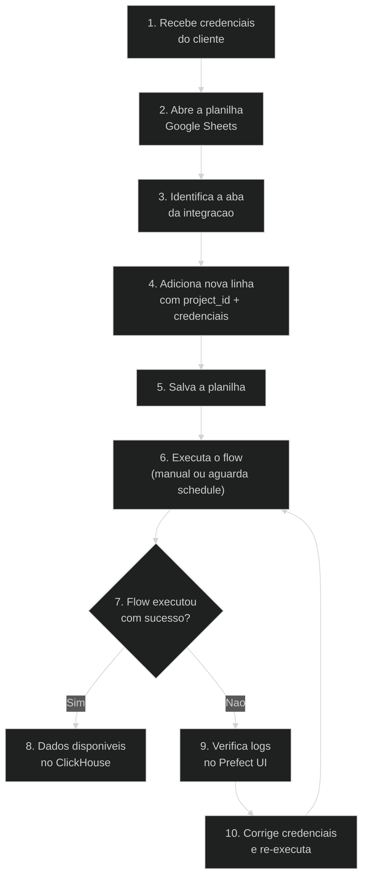

# Como Cadastrar um Novo Cliente

> **Guia passo a passo para cadastrar um novo cliente no pipeline. Nao requer codigo.**
>
> **Publico-alvo:** Equipe de CS / Operacoes

---

## Pre-requisitos

- Acesso de edicao a [Planilha de Configuracao](https://docs.google.com/spreadsheets/d/1ZA4rVPpHqDNvdw7t1gajgoCeV1uAaIM_sdI90BUCKIE)
- Credenciais da plataforma do cliente (API key, token, etc.)

---

## Passo a Passo

### 1. Identificar a integracao

Localize a aba correspondente na planilha:

| Aba | Integracao | Exemplo de credenciais |
|-----|-----------|----------------------|
| Meta Ads | Facebook/Instagram Ads | `access_token`, `accounts_ids` |
| Google Ads | Google Ads | `developer_token`, `client_id`, `refresh_token` |
| HubSpot | HubSpot CRM | `api_key` ou via Google Sheets |
| Asaas | Asaas Financeiro | `access_token`, `api_url` |
| Shopify | Shopify E-commerce | `shop_name`, `access_token` |
| *... e mais 37 integracoes* | | |

### 2. Adicionar nova linha na aba

Na aba correspondente, adicione uma nova linha com os dados:

| Coluna | Obrigatorio | Descricao |
|--------|-------------|-----------|
| `project_id` | Recomendado | Identificador unico do cliente (ex: `empresa_abc`) |
| `company_name` | Alternativo | Nome da empresa (usado para gerar `project_id` automatico) |
| `company_id` | Opcional | ID da empresa no sistema (gerado automaticamente se vazio) |
| *credenciais* | Sim | Campos especificos da plataforma (token, api_key, etc.) |

**Importante:**
- Se `project_id` estiver vazio, o sistema gera um automaticamente a partir do `company_name`
- O `project_id` e usado para separar dados no ClickHouse e MinIO
- Use nomes em snake_case sem acentos (ex: `empresa_abc`, `loja_xyz`)

### 3. Validar as credenciais

Antes de salvar, verifique:
- O token/API key esta ativo e nao expirado
- O escopo de acesso permite leitura dos dados necessarios
- Para OAuth2 (Meta Ads, Google Ads), o refresh token esta configurado

### 4. Executar o flow

Apos salvar a planilha, o novo cliente sera processado na proxima execucao do flow. Para testar imediatamente:

**Via Prefect UI:**
1. Acesse `http://prefect-server:4200`
2. Encontre o deployment correspondente (ex: `meta-ads-multiclient`)
3. Clique em "Run" → "Quick Run"
4. Opcional: defina `date_start` e `date_stop` para limitar o periodo

**Via CLI:**
```bash
prefect deployment run "Meta Ads to ClickHouse/meta-ads-multiclient"
```

### 5. Verificar os dados

Apos a execucao, verifique no ClickHouse:

```sql
-- Ver dados do novo cliente
SELECT count(*) FROM marketing.meta_ad_insights
WHERE project_id = 'empresa_abc';

-- Ver ultimas insercoes
SELECT * FROM marketing.meta_ad_insights
WHERE project_id = 'empresa_abc'
ORDER BY updated_at DESC
LIMIT 10;
```

---

## Diagrama do Processo



---

## Dicas

- **Multiplas contas:** Alguns conectores suportam multiplas contas por linha (ex: Meta Ads aceita `accounts_ids` separados por virgula)
- **Testar com periodo curto:** Use `date_start` e `date_stop` proximos (ex: ultimos 2 dias) para validar rapidamente
- **Dados no MinIO:** Os dados brutos ficam em `s3://raw-data/{integracao}/{project_id}/`
- **Alerta de falha:** Se o flow falhar, um email e enviado para `suporte@nalk.com.br`

---

## Troubleshooting

| Problema | Causa Provavel | Solucao |
|----------|---------------|---------|
| Cliente nao aparece na execucao | `project_id` vazio e sem `company_name` | Preencha ao menos um dos dois campos |
| Erro de autenticacao | Token expirado ou invalido | Gere novo token na plataforma |
| Dados vazios | Periodo sem dados ou conta sem atividade | Amplie o `date_start` |
| Erro "rate limit" | Muitas requisicoes a API | Aguarde e re-execute |
| Dados duplicados | Reexecucao no mesmo periodo | Normal: ClickHouse usa `ReplacingMergeTree` para deduplicar |

---

*Documentacao atualizada em Marco 2026.*
