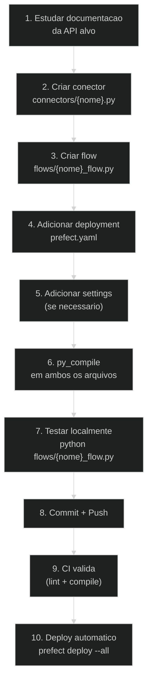

# Como Criar uma Nova Integracao

> **Guia completo para desenvolvedores criarem um novo conector de integracao.**
>
> **Publico-alvo:** Desenvolvedores

---

## Resumo

Para adicionar uma nova integracao, voce precisa criar **3 arquivos** e modificar **2 existentes**:

| Acao | Arquivo | Descricao |
|------|---------|-----------|
| Criar | `connectors/{nome}.py` | Conector que extrai dados da API |
| Criar | `flows/{nome}_flow.py` | Flow Prefect que orquestra a execucao |
| Modificar | `prefect.yaml` | Adicionar deployment |
| Modificar | `config/settings.py` | Adicionar campos de credenciais (se necessario) |
| Opcional | `.env.example` | Documentar variaveis de ambiente |

---

## Passo 1: Criar o Conector

Crie o arquivo `connectors/{nome}.py` seguindo o padrao `BaseConnector`:

```python
# connectors/exemplo.py
import requests
import pandas as pd
from datetime import datetime
from connectors.base import BaseConnector
from config.settings import settings
import logging

logger = logging.getLogger(__name__)


class ExemploConnector(BaseConnector):
    """Conector para a API Exemplo."""

    BASE_URL = "https://api.exemplo.com/v1"

    def __init__(self, api_token: str = None):
        self.api_token = api_token or settings.exemplo_api_token

    def _headers(self):
        return {
            "Authorization": f"Bearer {self.api_token}",
            "Content-Type": "application/json",
        }

    def _fetch_paginated(self, endpoint: str, params: dict = None) -> list:
        """Busca dados com paginacao."""
        all_data = []
        page = 1
        params = params or {}

        while True:
            params["page"] = page
            params["per_page"] = 100

            resp = requests.get(
                f"{self.BASE_URL}/{endpoint}",
                headers=self._headers(),
                params=params,
                timeout=30,
            )
            resp.raise_for_status()
            data = resp.json()

            # Adaptar conforme formato da API
            items = data.get("data", data.get("items", []))
            if not items:
                break

            all_data.extend(items)
            page += 1

        return all_data

    def extract(self, date_start: datetime, date_stop: datetime) -> dict:
        """Extrai dados da API Exemplo."""
        logger.info("Extraindo dados Exemplo de %s a %s", date_start, date_stop)

        # Extrair cada tabela
        contacts = self._fetch_paginated("contacts", {
            "updated_after": date_start.strftime("%Y-%m-%d"),
        })
        deals = self._fetch_paginated("deals", {
            "updated_after": date_start.strftime("%Y-%m-%d"),
        })

        result = {}

        if contacts:
            df = pd.json_normalize(contacts, sep="_")
            df["updated_at"] = datetime.now().strftime("%Y-%m-%d %H:%M:%S")
            result["exemplo_contacts"] = df

        if deals:
            df = pd.json_normalize(deals, sep="_")
            df["updated_at"] = datetime.now().strftime("%Y-%m-%d %H:%M:%S")
            result["exemplo_deals"] = df

        return result

    def get_tables_ddl(self) -> list:
        """DDL para ClickHouse."""
        return [
            """
            CREATE TABLE IF NOT EXISTS marketing.exemplo_contacts (
                id String,
                name String,
                email String,
                phone String,
                created_at String,
                project_id String DEFAULT 'unknown',
                updated_at DateTime DEFAULT now()
            ) ENGINE = ReplacingMergeTree(updated_at)
            ORDER BY (id, project_id)
            """,
            """
            CREATE TABLE IF NOT EXISTS marketing.exemplo_deals (
                id String,
                title String,
                value Float64,
                stage String,
                contact_id String,
                created_at String,
                project_id String DEFAULT 'unknown',
                updated_at DateTime DEFAULT now()
            ) ENGINE = ReplacingMergeTree(updated_at)
            ORDER BY (id, project_id)
            """,
        ]
```

### Checklist do Conector

- [ ] Herda `BaseConnector`
- [ ] Implementa `extract(date_start, date_stop) -> dict`
- [ ] Implementa `get_tables_ddl() -> list`
- [ ] Cada tabela tem `project_id String DEFAULT 'unknown'`
- [ ] Cada tabela tem `updated_at DateTime DEFAULT now()`
- [ ] Engine e `ReplacingMergeTree(updated_at)`
- [ ] ORDER BY inclui campos de identidade + `project_id`
- [ ] Paginacao implementada corretamente
- [ ] Timeout em todas as requests (30s)
- [ ] Credenciais vem do construtor OU de `settings`

---

## Passo 2: Criar o Flow

Crie o arquivo `flows/{nome}_flow.py` seguindo o padrao multi-cliente:

```python
# flows/exemplo_flow.py
from prefect import flow, task
from connectors.exemplo import ExemploConnector
from connectors.clickhouse_client import ClickHouseClient
from connectors.datalake import DatalakeConnector
from scripts.gsheets_manager import GSheetsManager
from datetime import datetime, timedelta
import logging

logger = logging.getLogger(__name__)


@task(retries=3, retry_delay_seconds=60)
def extract_exemplo_data(date_start: datetime, date_stop: datetime, credentials: dict):
    connector = ExemploConnector(
        api_token=credentials.get("api_token") or credentials.get("exemplo_api_token"),
    )
    data = connector.extract(date_start, date_stop)

    # Injeta project_id em todos os DataFrames
    for df in data.values():
        if not df.empty:
            df["project_id"] = credentials.get("project_id", "unknown-client")

    return data


@task
def create_tables():
    ch = ClickHouseClient()
    connector = ExemploConnector()
    ch.create_database()
    ch.run_ddl(connector.get_tables_ddl())


@task
def load_to_clickhouse(data_dict: dict, credentials: dict, dt_stop: datetime):
    ch = ClickHouseClient()
    lake = DatalakeConnector()

    company_name = credentials.get("project_id", "unknown-client")
    date_path = dt_stop.strftime("%Y%m%d")

    for table_name, df in data_dict.items():
        if not df.empty:
            bucket = "raw-data"
            s3_key = f"exemplo/{company_name}/{table_name}_run_{date_path}.parquet"

            logger.info("[%s] Upload MinIO (%d linhas)", table_name, len(df))
            s3_url = lake.push_dataframe_to_parquet(df, bucket, s3_key)

            if s3_url:
                try:
                    ch.insert_from_s3(table_name, s3_url)
                except Exception as err:
                    logger.warning("[%s] Fallback insert: %s", table_name, err)
                    ch.insert_dataframe(table_name, df)


@flow(name="Exemplo to ClickHouse")
def exemplo_pipeline(date_start: str = None, date_stop: str = None):
    SHEET_ID = "1ZA4rVPpHqDNvdw7t1gajgoCeV1uAaIM_sdI90BUCKIE"
    GID_EXEMPLO = "XXXXXXXXXX"  # Substituir pelo GID real da aba

    manager = GSheetsManager(sheet_id=SHEET_ID)
    clients = manager.get_tab_data(gid=GID_EXEMPLO)

    if not clients:
        logger.warning("Nenhum cliente encontrado para Exemplo.")
        return

    if not date_start:
        date_start = (datetime.now() - timedelta(days=2)).strftime("%Y-%m-%d")
    if not date_stop:
        date_stop = datetime.now().strftime("%Y-%m-%d")

    dt_start = datetime.strptime(date_start, "%Y-%m-%d")
    dt_stop = datetime.strptime(date_stop, "%Y-%m-%d")

    create_tables()

    for client in clients:
        company = client.get("project_id", "Unknown")
        logger.info("--> Processando Exemplo: %s", company)

        try:
            data = extract_exemplo_data(dt_start, dt_stop, credentials=client)
            load_to_clickhouse(data, client, dt_stop)
        except Exception as e:
            logger.error("Falha Exemplo para %s: %s", company, e)


if __name__ == "__main__":
    exemplo_pipeline()
```

### Checklist do Flow

- [ ] Usa `@flow` e `@task` do Prefect
- [ ] Task de extract tem `retries=3, retry_delay_seconds=60`
- [ ] Busca clientes via `GSheetsManager`
- [ ] Cria tabelas antes do loop
- [ ] Loop por cliente com try/except
- [ ] Injeta `project_id` em cada DataFrame
- [ ] Load usa MinIO (S3) com fallback para insert direto
- [ ] Parametros `date_start` e `date_stop` opcionais
- [ ] Default de datas: ultimos 2 dias ate hoje

---

## Passo 3: Adicionar Deployment

Edite `prefect.yaml` e adicione na categoria apropriada:

```yaml
  # Adicionar no grupo correto
  - name: exemplo-multiclient
    entrypoint: flows/exemplo_flow.py:exemplo_pipeline
    parameters:
      date_start: null
      date_stop: null
    work_pool:
      name: default
```

---

## Passo 4: Configurar Credenciais (se necessario)

Se o conector usar credenciais globais (nao apenas da planilha), adicione em `config/settings.py`:

```python
# Exemplo
exemplo_api_token: Optional[str] = None
exemplo_api_url: Optional[str] = None
```

E documente em `.env.example`:

```bash
# Exemplo
# EXEMPLO_API_TOKEN=
# EXEMPLO_API_URL=https://api.exemplo.com/v1
```

---

## Passo 5: Validar

```bash
# 1. Verificar sintaxe
python -m py_compile connectors/exemplo.py
python -m py_compile flows/exemplo_flow.py

# 2. Verificar YAML
python -c "import yaml; yaml.safe_load(open('prefect.yaml'))"

# 3. Testar localmente
python flows/exemplo_flow.py

# 4. Registrar deployment
prefect deploy --name exemplo-multiclient
```

---

## Diagrama do Processo



---

## Padroes de Paginacao

Escolha o padrao correto conforme a API:

### Offset-based
```python
while True:
    resp = requests.get(url, params={"offset": offset, "limit": 100})
    items = resp.json().get("data", [])
    if not items:
        break
    all_data.extend(items)
    offset += len(items)
```

### Page-based
```python
page = 1
while True:
    resp = requests.get(url, params={"page": page, "per_page": 100})
    items = resp.json().get("data", [])
    if not items:
        break
    all_data.extend(items)
    page += 1
```

### Cursor-based
```python
cursor = None
while True:
    params = {"limit": 100}
    if cursor:
        params["cursor"] = cursor
    resp = requests.get(url, params=params)
    data = resp.json()
    all_data.extend(data.get("items", []))
    cursor = data.get("next_cursor")
    if not cursor:
        break
```

### Sem paginacao
```python
resp = requests.get(url)
all_data = resp.json().get("data", [])
```

---

## Tipos de Autenticacao

### Bearer Token
```python
headers = {"Authorization": f"Bearer {token}"}
```

### API Key (header customizado)
```python
headers = {"api-key": api_key}
```

### Basic Auth
```python
import base64
credentials = base64.b64encode(f"{user}:{password}".encode()).decode()
headers = {"Authorization": f"Basic {credentials}"}
```

### OAuth2 (client_credentials)
```python
resp = requests.post(token_url, data={
    "grant_type": "client_credentials",
    "client_id": client_id,
    "client_secret": client_secret,
})
token = resp.json()["access_token"]
headers = {"Authorization": f"Bearer {token}"}
```

---

*Documentacao atualizada em Marco 2026.*
