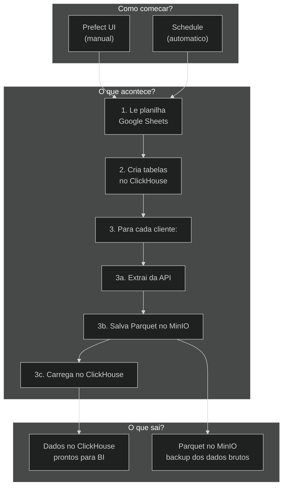

# Guia do Desenvolvedor

> **Guia geral com metaforas, glossario e decisoes arquiteturais.**
>
> **Publico-alvo:** Desenvolvedores juniores e seniores

---

## O que e esse projeto?

Imagine uma **fabrica de dados**. Dezenas de empresas usam ferramentas diferentes — CRMs, plataformas de anuncios, ERPs, e-commerce. Cada ferramenta tem sua propria API com dados valiosos. O nosso pipeline e a **esteira** que:

1. **Coleta** dados de 42+ APIs diferentes
2. **Armazena** os dados brutos em um deposito seguro (MinIO)
3. **Organiza** os dados em um banco analitico (ClickHouse)
4. **Monitora** a saude de tudo e avisa quando algo da errado

```
  APIs (42+)          MinIO            ClickHouse         BI/Analytics
  ┌─────────┐      ┌──────────┐      ┌──────────┐      ┌──────────┐
  │ Meta Ads │─────>│          │─────>│          │─────>│          │
  │ HubSpot  │─────>│  Parquet │─────>│  Tabelas │─────>│Dashboards│
  │ Shopify  │─────>│  Files   │─────>│  OLAP    │─────>│ Reports  │
  │   ...    │─────>│          │─────>│          │─────>│          │
  └─────────┘      └──────────┘      └──────────┘      └──────────┘
                    (deposito)         (escritorio)       (relatorios)
```

---

## Glossario

| Termo | O que e | Analogia |
|-------|---------|----------|
| **Conector** | Classe Python que sabe falar com uma API especifica | Um "tradutor" que fala a lingua de cada ferramenta |
| **Flow** | Orquestracao Prefect que coordena extract → load | O "gerente de producao" da esteira |
| **Task** | Unidade de trabalho dentro de um flow | Uma "etapa" da esteira |
| **Deployment** | Configuracao no Prefect para agendar/executar flows | A "programacao" da fabrica |
| **Data Lake (MinIO)** | Armazenamento de dados brutos em Parquet | O "deposito" com todos os dados originais |
| **Data Warehouse (ClickHouse)** | Banco colunar otimizado para consultas analiticas | O "escritorio" organizado para analise |
| **Multi-tenant** | Suporte a multiplos clientes no mesmo pipeline | Uma fabrica que atende varios pedidos |
| **project_id** | Identificador unico de cada cliente | O "numero do pedido" |
| **BaseConnector** | Classe abstrata que define a interface | O "manual de instrucoes" que todo tradutor segue |
| **GSheetsManager** | Leitor de configuracao de clientes | A "lista de pedidos" |
| **ReplacingMergeTree** | Engine do ClickHouse que deduplica dados | Uma secretaria que descarta copias antigas |
| **C2C (Container-to-Container)** | Comunicacao direta entre servicos Docker | Passagem direta entre setores da fabrica |
| **Parquet** | Formato colunar comprimido para dados | Uma "caixa" eficiente para guardar dados |

---

## Estrutura do Projeto Explicada

```
teste-pipeline/
│
├── config/settings.py       ← "Painel de controle" central
│                               Todas as credenciais e configs
│
├── connectors/              ← "Tradutores" - um por plataforma
│   ├── base.py              ← Interface que todos seguem
│   ├── clickhouse_client.py ← Fala com o banco de dados
│   ├── datalake.py          ← Fala com o MinIO (deposito)
│   ├── meta_ads.py          ← Fala com Facebook/Instagram
│   ├── hubspot.py           ← Fala com HubSpot
│   └── ... (40 conectores)
│
├── flows/                   ← "Gerentes" - coordenam o trabalho
│   ├── meta_ads_flow.py     ← Coordena extracao do Meta Ads
│   ├── hubspot_flow.py      ← Coordena extracao do HubSpot
│   ├── health_check_flow.py ← Verifica saude do sistema
│   └── ... (41 flows)
│
├── scripts/                 ← "Ferramentas auxiliares"
│   ├── gsheets_manager.py   ← Le lista de clientes
│   ├── alerting.py          ← Envia emails de alerta
│   ├── monitor.py           ← Monitora CPU/memoria
│   └── webhook_notifier.py  ← Avisa o backoffice
│
├── prefect.yaml             ← "Agenda" - todos os deployments
├── docker-compose.yml       ← "Planta da fabrica" - servicos
├── Dockerfile               ← "Receita" de como montar o worker
└── requirements.txt         ← "Lista de compras" de bibliotecas
```

---

## Como tudo funciona junto



---

## Para Desenvolvedores Juniores

### Por onde comecar?

1. **Leia** [architecture-overview.md](./architecture-overview.md) para entender o todo
2. **Escolha** um conector simples como referencia (ex: `connectors/brevo.py` ou `connectors/native.py`)
3. **Compare** com o flow correspondente (ex: `flows/brevo_flow.py`)
4. **Entenda** o padrao: Conector extrai → Flow orquestra → ClickHouse recebe

### Seu primeiro conector

Siga o guia em [howto-add-crm-integration.md](./howto-add-crm-integration.md). Resumo:

1. Crie `connectors/meu_conector.py` herdando `BaseConnector`
2. Implemente `extract()` e `get_tables_ddl()`
3. Crie `flows/meu_conector_flow.py` copiando o padrao
4. Adicione deployment em `prefect.yaml`
5. Teste com `python -m py_compile` e `python flows/meu_conector_flow.py`

### Dicas importantes

- **Sempre** use `timeout=30` nas requests
- **Sempre** adicione `project_id` e `updated_at` nas tabelas
- **Nunca** commite `.env`, `credentials.json` ou chaves de API
- **Sempre** trate erros com try/except no loop de clientes (um cliente falhar nao deve parar os outros)
- **Use** `pd.json_normalize(data, sep="_")` para achatar JSONs aninhados
- **Use** `ReplacingMergeTree(updated_at)` para que reexecucoes nao dupliquem dados

---

## Para Desenvolvedores Seniores

### Decisoes Arquiteturais

| Decisao | Escolha | Justificativa |
|---------|---------|---------------|
| Orquestrador | Prefect 2.x (nao Airflow) | Menor overhead operacional, melhor DX, nativamente Python |
| Data Lake | MinIO (nao S3/GCS) | Self-hosted, sem custo cloud, S3-compatible |
| Data Warehouse | ClickHouse (nao BigQuery/Postgres) | Performance OLAP superior, compressao nativa, gratuito |
| Formato raw | Parquet (nao CSV/JSON) | Colunar, comprimido, tipado, suporte nativo no ClickHouse |
| Config multi-cliente | Google Sheets (nao DB) | Zero infra, editavel por CS, sem deploy para alterar |
| Deduplicacao | ReplacingMergeTree | Nativa do ClickHouse, eventual consistency aceitavel |
| Retry | Prefect tasks (3x, 60s) | Built-in, com logging e visibilidade no UI |
| CI/CD | GitHub Actions | Integrado ao repo, sem infra adicional |

### Trade-offs conhecidos

| Area | Trade-off | Impacto |
|------|-----------|---------|
| **Processamento** | Sequencial por cliente (nao paralelo) | Mais lento, mas mais seguro e previsivel |
| **Config** | Google Sheets publica (CSV export) | Simples mas sem controle de versao |
| **Deduplicacao** | ReplacingMergeTree e eventual | Queries podem retornar duplicatas temporarias (use `FINAL`) |
| **Credenciais** | Mix de .env, Sheets e Prefect Variables | Flexivel mas pode confundir |
| **Flows** | 1 flow por integracao (nao generico) | Redundancia de codigo mas facil de entender e debugar |
| **Fallback S3→insert** | Se S3 falha, insere direto via Python | Mais lento mas garante que dados nao se perdem |

### Pontos de melhoria identificados

Consulte [analise-arquitetural.md](./analise-arquitetural.md) para analise detalhada de:
- Redundancia de codigo (~47% do codebase)
- Oportunidades de aplicacao de SOLID
- Proposta de arquitetura hexagonal
- Estimativa de reducao de codigo (9.150 → 4.500 LOC)

---

## Ambiente de Desenvolvimento

### Pre-requisitos

- Python 3.11+
- Docker + Docker Compose
- Git

### Setup local

```bash
# 1. Clonar
git clone <repo-url>
cd teste-pipeline

# 2. Ambiente virtual
python -m venv venv
source venv/bin/activate  # Linux/Mac
# venv\Scripts\activate   # Windows

# 3. Dependencias
pip install -r requirements.txt

# 4. Configuracao
cp .env.example .env
# Editar .env com suas credenciais

# 5. Subir infraestrutura
docker-compose up -d

# 6. Verificar saude
python flows/health_check_flow.py
```

### Comandos uteis

```bash
# Verificar sintaxe de todos os arquivos
find connectors/ flows/ scripts/ config/ -name "*.py" -exec python -m py_compile {} \;

# Executar um flow especifico
python flows/meta_ads_flow.py

# Ver logs do Prefect
docker-compose logs -f prefect-worker

# Acessar UI do Prefect
# http://localhost:4200

# Acessar Console do MinIO
# http://localhost:9001 (admin / miniopassword123)

# Query no ClickHouse
# http://localhost:8123 (via clickhouse-client ou DBeaver)
```

---

## FAQ

**P: Posso testar um conector sem o Prefect rodando?**
R: Sim! Execute `python flows/{nome}_flow.py` direto. O Prefect roda localmente se nao encontrar servidor.

**P: O que acontece se eu rodar o mesmo flow duas vezes?**
R: Os dados sao re-inseridos, mas o `ReplacingMergeTree` eventualmente remove duplicatas pela coluna `updated_at`.

**P: Preciso configurar todas as 42 integracoes?**
R: Nao. Cada integracao e independente. Configure apenas as que precisar.

**P: Como sei se um flow falhou?**
R: 1) Prefect UI mostra status, 2) Email e enviado para `suporte@nalk.com.br`, 3) Webhook notifica o backoffice.

**P: Onde ficam os dados brutos?**
R: No MinIO, bucket `raw-data`, organizados por: `{integracao}/{project_id}/{tabela}_run_{data}.parquet`

**P: Como forcar deduplicacao imediata no ClickHouse?**
R: `OPTIMIZE TABLE marketing.{tabela} FINAL` — mas isso e custoso, use com moderacao.

---

*Documentacao atualizada em Marco 2026.*
