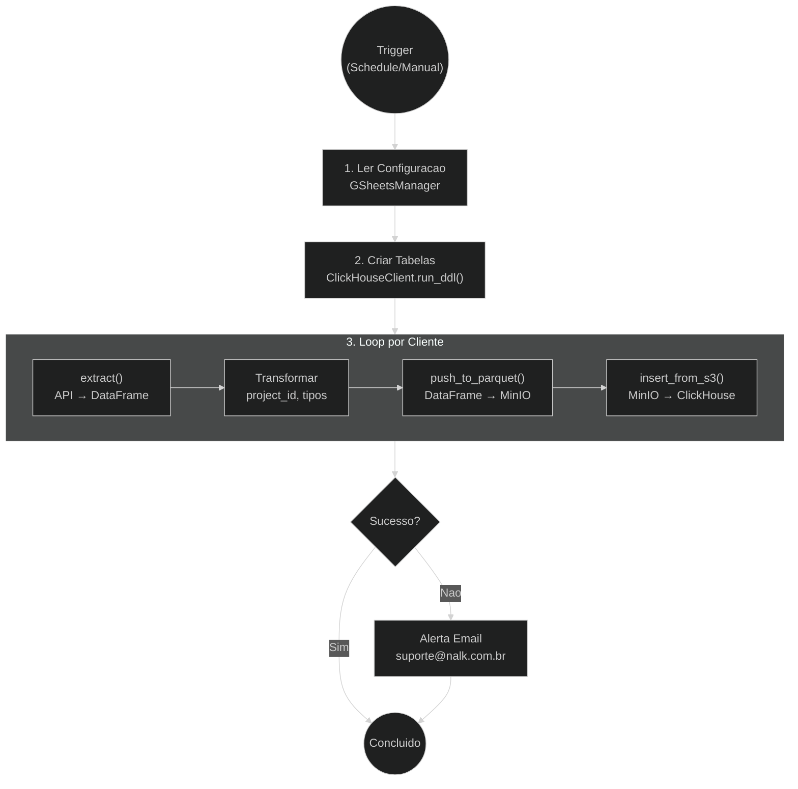
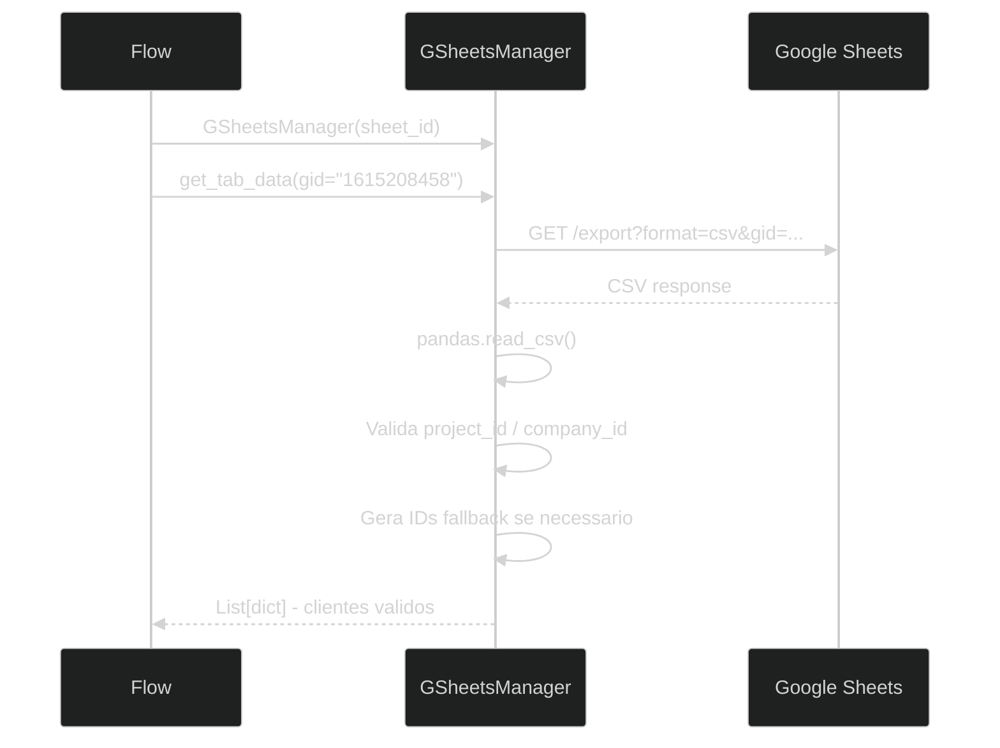
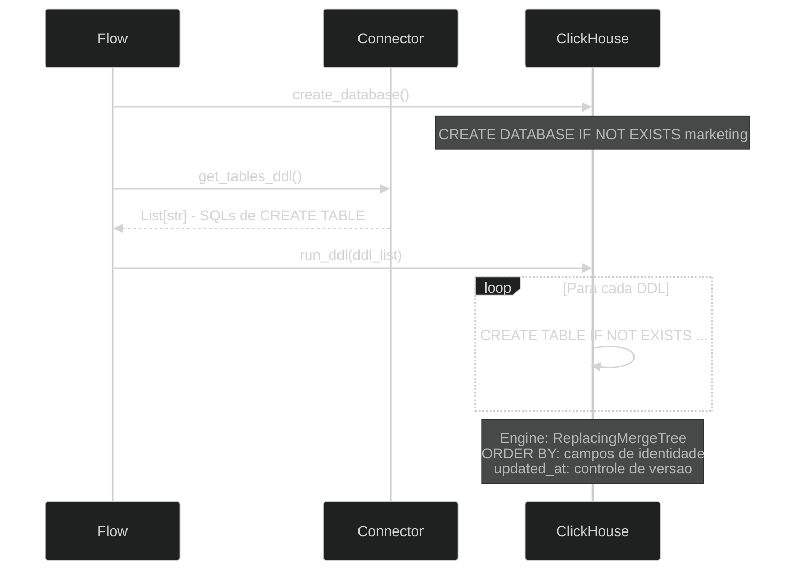
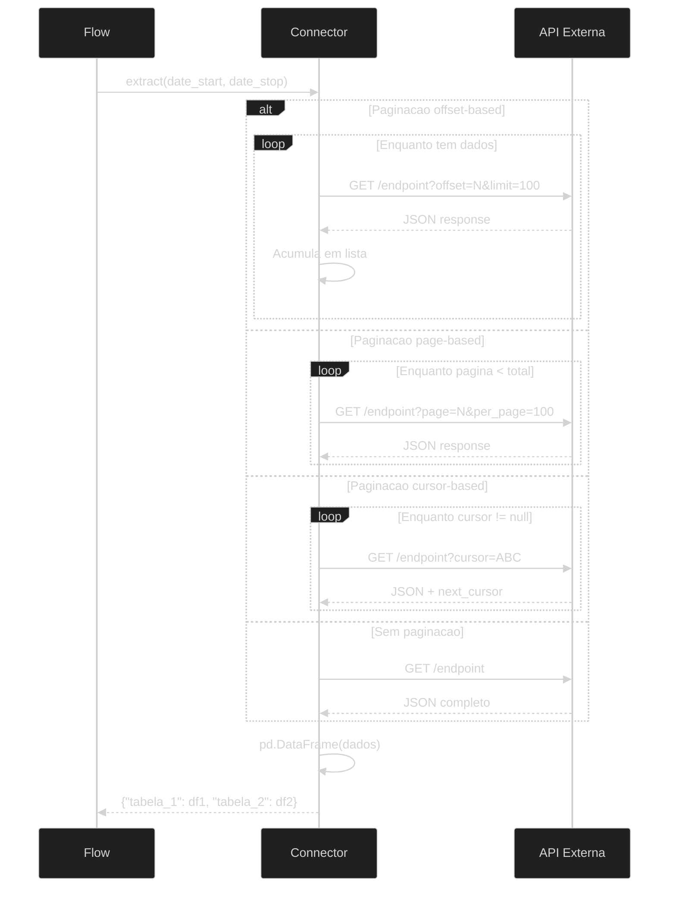
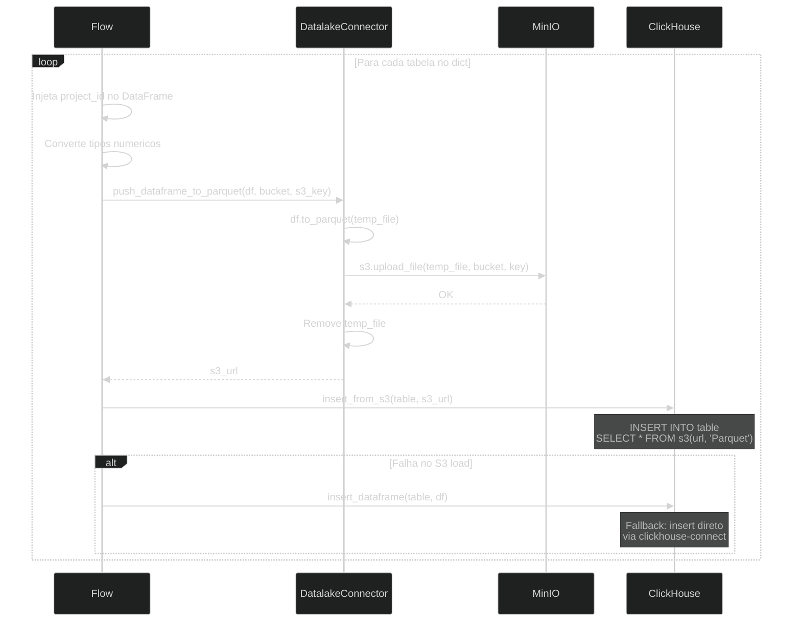
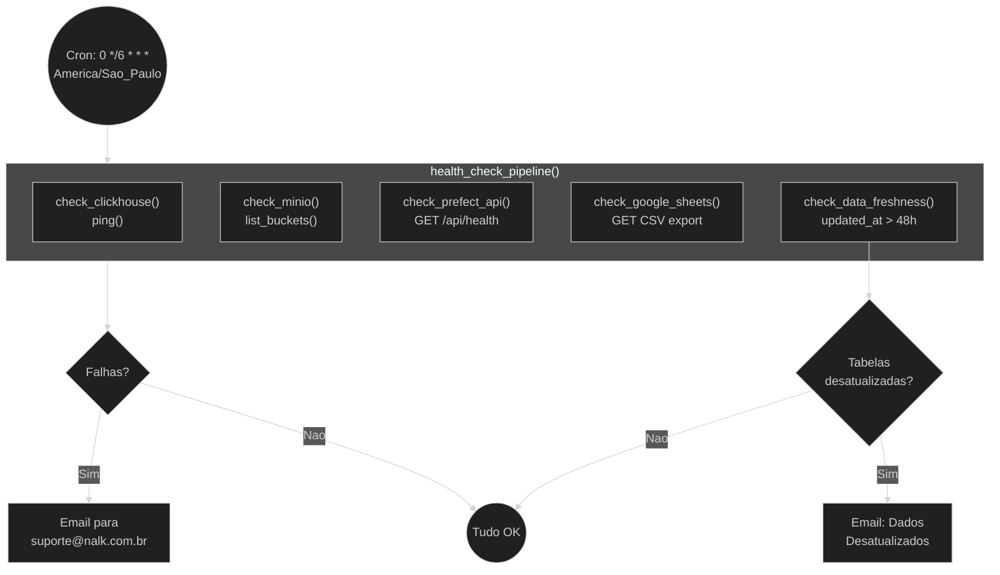
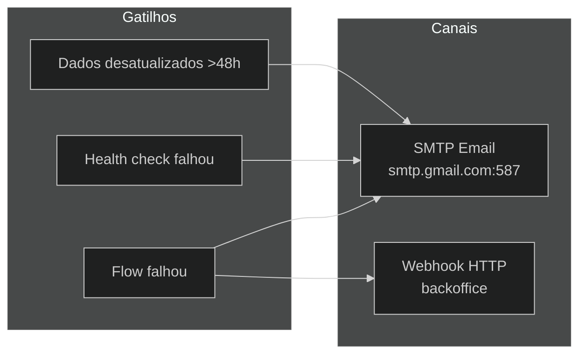
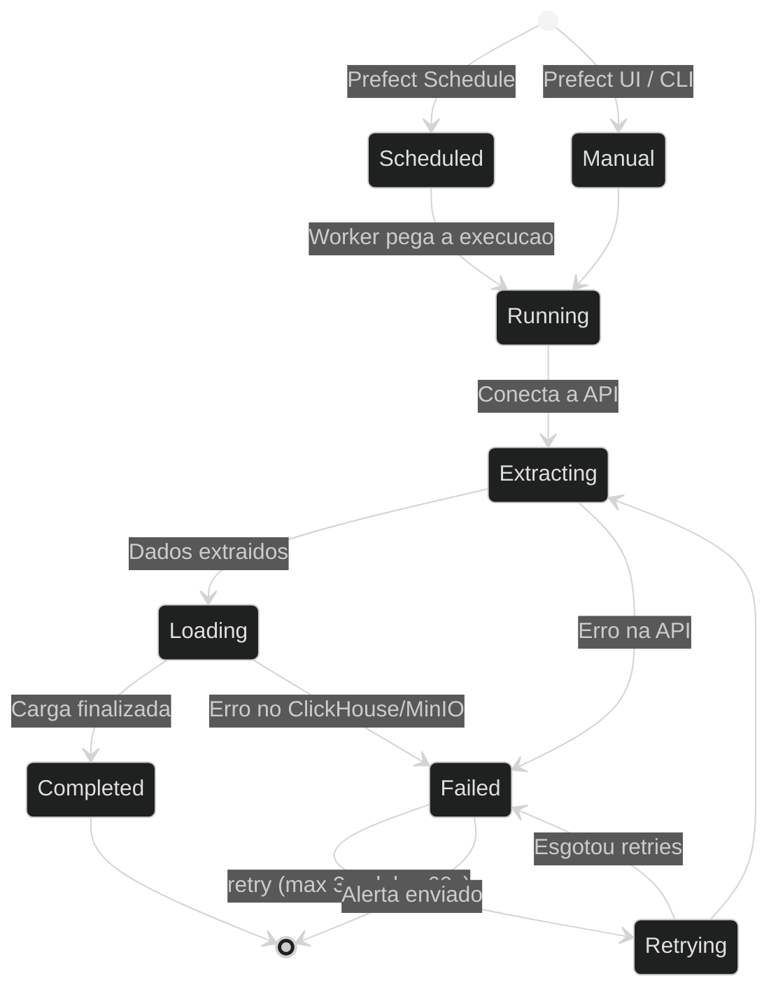

# Fluxos do Pipeline - Diagramas e Etapas

> **Diagramas detalhados de cada etapa do pipeline de dados.**

---

## Visao Geral do Fluxo



---

## Etapa 1: Leitura de Configuracao



**Detalhes:**
- A planilha Google Sheets e publica (somente leitura)
- Cada aba corresponde a uma integracao (Meta Ads, HubSpot, etc.)
- Cada linha = 1 cliente com suas credenciais
- Se `project_id` ou `company_id` estiverem vazios, sao gerados automaticamente a partir do nome do cliente

---

## Etapa 2: Criacao de Tabelas



**Padrao DDL (ClickHouse):**
```sql
CREATE TABLE IF NOT EXISTS marketing.meta_ad_insights (
    date_start Date,
    campaign_id String,
    campaign_name String,
    impressions Float64,
    clicks Float64,
    spend Float64,
    project_id String DEFAULT 'unknown',
    updated_at DateTime DEFAULT now()
) ENGINE = ReplacingMergeTree(updated_at)
ORDER BY (date_start, campaign_id, project_id)
```

---

## Etapa 3: Extracao (Extract)



**Tipos de autenticacao usados pelos conectores:**

| Tipo | Conectores | Exemplo |
|------|-----------|---------|
| Bearer Token | Arbo, C2S, Clicksign, Groner, etc. | `Authorization: Bearer {token}` |
| API Key (header) | Brevo, Moskit, Ploomes | `api-key: {key}` ou `apikey: {key}` |
| Basic Auth | Vindi, Evo | `Authorization: Basic base64(user:pass)` |
| OAuth2 | Mautic, Learn Words | `client_credentials → Bearer` |
| Login + Token | Hypnobox, Native, Sigavi | POST login → token → Bearer |
| Headers customizados | CVCRM, Facilita, Superlogica | `email`, `token`, `app_token` |
| SDK nativo | Meta Ads, Google Ads, HubSpot | Facebook Business SDK, Google Ads API |

---

## Etapa 4: Carga (Load)



**Organizacao no MinIO:**
```
raw-data/
├── meta_ads/
│   ├── cliente_a/
│   │   ├── meta_ad_insights_run_20260313.parquet
│   │   └── meta_campaigns_run_20260313.parquet
│   └── cliente_b/
│       └── ...
├── hubspot/
│   ├── cliente_x/
│   │   ├── hubspot_contacts_run_20260313.parquet
│   │   └── ...
│   └── ...
└── ...
```

---

## Fluxo de Health Check



---

## Fluxo de Alertas



**Configuracao de alertas:**
- **De:** pipeline@nalk.com.br
- **Para:** suporte@nalk.com.br
- **SMTP:** smtp.gmail.com:587 (TLS)
- **Webhook:** POST para `{backoffice_endpoint}/airflow/webhook` com retry exponencial (5 tentativas)

---

## Ciclo de Vida de uma Execucao



---

## Prefect Deployments

Todos os deployments estao configurados em `prefect.yaml`:

| Deployment | Flow | Work Pool | Parametros |
|------------|------|-----------|-----------|
| 42 integracoes | `{nome}_pipeline()` | default | `date_start`, `date_stop` |
| health-check | `health_check_pipeline()` | default | nenhum |

**Schedule ativo:** Apenas `health-check` (cron: `0 */6 * * *`)

Os demais flows sao executados manualmente via Prefect UI ou API, ou podem ter schedules adicionados no `prefect.yaml`.

---

*Documentacao atualizada em Marco 2026.*
